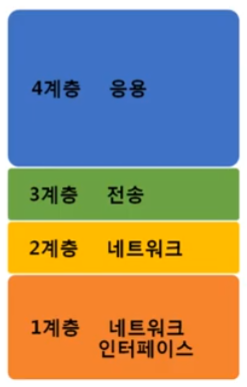
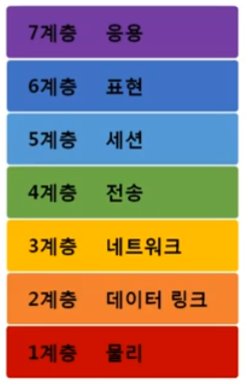
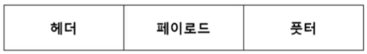
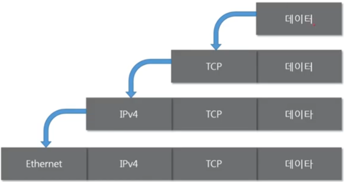
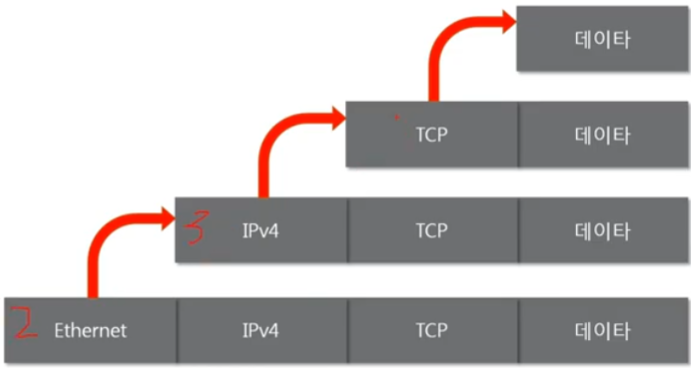

전체영상: [네트워크 기초(개정판)](https://www.youtube.com/playlist?list=PL0d8NnikouEWcF1jJueLdjRIC4HsUlULi)

### [네트워크란?](https://youtu.be/Av9UFzl_wis?list=PL0d8NnikouEWcF1jJueLdjRIC4HsUlULi)

- 노드들이 데이터를 공유할 수 있게 하는 디지털 전기통신망의 하나이다.
  - 노드 : 네트워크에 속한 컴퓨터 또는 통신 장비
- 즉, 분산되어 있는 컴퓨터를 통신망으로 연결한 것을 말한다.
- 네트워크에서 여러 장치들은 노드 간 연결을 사용하여 서로에게 데이터를 교환한다.

### 인터넷이란?

- 문서, 그림 영상과 같은 여러가지 데이터를 공유하도록 구성된 세상에서 가장 큰 전세계를 연결하는 네트워크

- 흔히 www를 인터넷으로 착각, www는 인터넷을 통해 웹과 관련된 데이터를 공유하는 것

### 네트워크의 분류

#### 크기에 따른 분류

- LAN (Local Area Network)
  - 가까운 지역을 하나로 묶은 네트워크
- WAN (Wide Area Network)
  - 멀리 있는 지역을 한데 묶은 네트워크
  - 가까운 지역끼리 묶인 LAN과 LAN을 다시 하나로 묶은 것

#### 연결 형태에 따른 분류

- Star (중앙 장비에 모든 노드가 연결)
- Mesh (여러 노드들이 서로 그물처럼 연결)
- 혼합형 (실제 인터넷은 여러 형태를 혼합한 형태)

### 네트워크의 통신방식

- 유니 캐스트 (특정 대상만이랑  1:1로 통신)
- 멀티 캐스트 (특정 다수와 1:N으로 통신)
- 브로드 캐스트 (네트워크에 있는 모든 대상과 통신)

### 네트워크 프로토콜

- 프로토콜이란?

  - 프로토콜은 일종의 약속, 양식

  - 네트워크에서 노드와 노드가 통신할 때 어떤 노드가 어느 노드에게

    어떤 데이터를 어떻게 보내는지 작성하기 위한 양식

    각 프로토콜들도 해당 프로토콜만의 양식

- 여러가지 프로토콜

  - 가까운 곳 - Ethernet 프로토콜 (MAC 주소)
  - 멀리 있는 곳 - ICMP, IPv4, ARP (IP 주소)
  - 여러가지 프로그램으로 연락 - TCP, UDP (포트 번호)
  - 패킷 (여러 프로토콜들로 캡슐화 된 패킷)

### [실습1 (tracert)](https://youtu.be/paJf7JbBWqY?list=PL0d8NnikouEWcF1jJueLdjRIC4HsUlULi)

- 

### [실습2 (Wireshark)](https://youtu.be/vBrQ3yzerMg?list=PL0d8NnikouEWcF1jJueLdjRIC4HsUlULi)

- 

### [네트워크 모델](https://youtu.be/y9nlT52SAcg?list=PL0d8NnikouEWcF1jJueLdjRIC4HsUlULi)

- TCP / IP 모델

  - 1960년대 말 미국방성의 연구에서 시작

    1980년대 초 프로토콜 모델로 공개

    현재의 인터넷에서 컴퓨터들이 서로 정보를 주고받는데 쓰이는

    통신 규약(프로토콜)의 모음

    

- OSI 7계층

  - 1984년 네트워크 통신을 체계적으로 다루는

    ISO에서 표준으로 지정한 모델

    데이터를 주고받을 때 데이터 자체의 흐름을

    각 구간별로 나눠 놓은 것

    

#### 공통점과 차이점

- 공통점
  - 계층적 네트워크 모델
  - 계층간 역할 정의
- 차이점
  - 계층의 수 차이
  - OSI는 역할 기반, TCP/IP는 프로토콜 기반
  - OSI는 통신 전반에 대한 표준
  - TCP/IP는 데이터 전송기술 특화

### 네트워크를 통해 전달되는 데이터, 패킷

#### 패킷이란?

- 패킷이란 네트워크 상에서 전달되는 데이터를 통칭하는 말

  네트워크에서 전달하는 데이터의 형식화된 블록

  패킷은 제어 정보와 사용자 데이터로 이루어지며

  사용자 데이터는 페이로드라고도 한다.

  

#### 캡슐화

- 여러 프로토콜을 이용해서 최종적으로 보낼 때 패킷을 만드는 과정

  

#### 디캡슐화

- 패킷을 받았을 때 프로토콜들을 하나씩 확인하면서 데이터를 확인하는 과정

  

#### 계층별 패킷의 이름 PDU

- 계층별로 이름이 다른 PDU(Protocol Data Unit)

