### [HTTP 프로토콜](https://youtu.be/TwsQX1AnWJU?list=PL0d8NnikouEWcF1jJueLdjRIC4HsUlULi)

- 웹을 만드는 기술들

  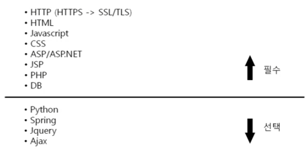

- HTTP 프로토콜의 특징

  - HyperText Transfer Protocol (하이퍼 텍스트 전송 프로토콜)

  - www에서 쓰이는 핵심 프로토콜로 문서의 전송을 위해 쓰이며, 오늘날 거의 모든 웹 어플리케이션에서 사용되고 있다.

    -> 음성, 화상 등 여러 종류의 데이터를 MIME로 정의하여 전송 가능

  - HTTP 특징

    Request / Response 동작에 기반하여 서비스 제공

  - HTTP 1.0의 특징

    "연결 수립, 동작, 연결 해제"의 단순함이 특징

    -> 하나의 URL은 하나의 TCP 연결

    HTML 문서를 전송 받은 뒤 연결을 끊고 다시 연결하여 데이터를 전송한다.

  - HTTP 1.0의 문제점

    단순 동작 (연결 수립, 동작, 연결 해제)이 반복되어 통신 부하 문제 발생

    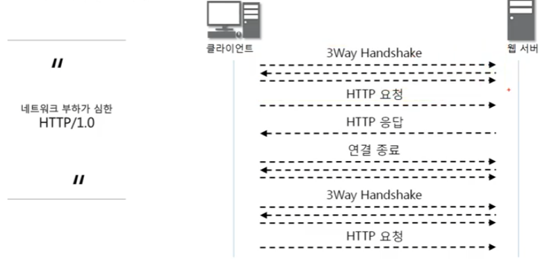

    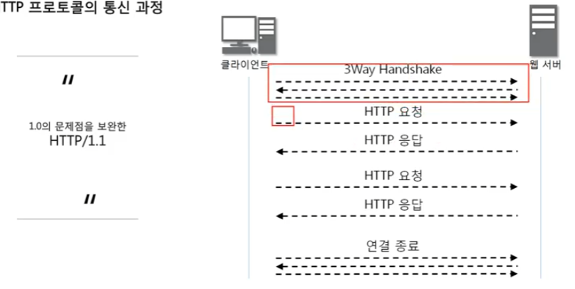

    

### [HTTP 요청 프로토콜](https://youtu.be/rxaBwwI_JnI?list=PL0d8NnikouEWcF1jJueLdjRIC4HsUlULi)

- HTTP Method 설명 중 GET, POST만 사용해야 한다고 하지만 개발자 입장에서 RESTful API 개발시 PUT, DELETE도 사용하는게 원칙임

- HTTP 요청 프로토콜의 구조

  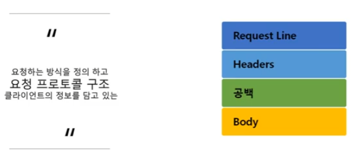

  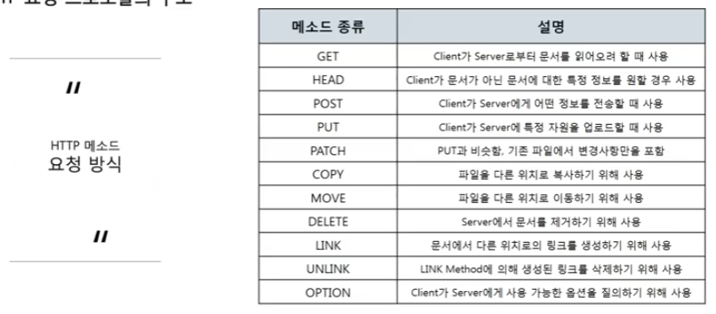

  

### [URL, URI란?](https://youtu.be/2ikhZ_fNP5Y?list=PL0d8NnikouEWcF1jJueLdjRIC4HsUlULi)

- URI (Uniform Resource Identifier)

  - 인터넷 상에서 특정 자원(파일)을 나타내는 유일한 주소

    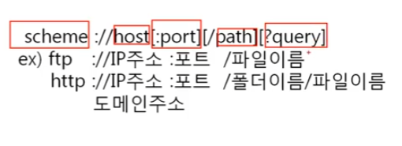

    

### [HTTP 요청 프로토콜 작성 실습](https://youtu.be/XbGJYsxed2w?list=PL0d8NnikouEWcF1jJueLdjRIC4HsUlULi)

- 

### [URI 이해를 위한 실습](https://youtu.be/HBojczyd1Ac?list=PL0d8NnikouEWcF1jJueLdjRIC4HsUlULi)

- 

### [HTTP 응답 프로토콜](https://youtu.be/kuucNF4Zvbs?list=PL0d8NnikouEWcF1jJueLdjRIC4HsUlULi)

- HTTP 응답 프로토콜의 구조

  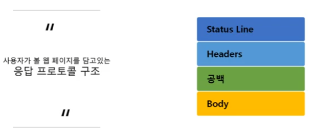

  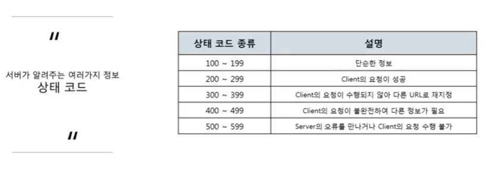

### [HTTP 헤더 포맷](https://youtu.be/mQTGmxendk8?list=PL0d8NnikouEWcF1jJueLdjRIC4HsUlULi)

- 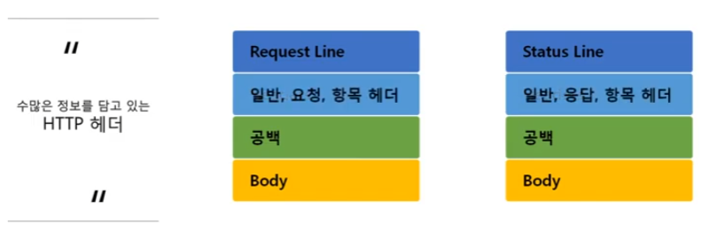

  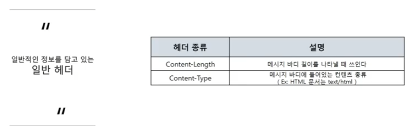

  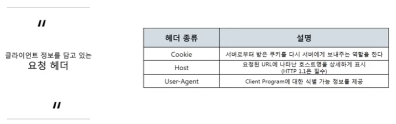

  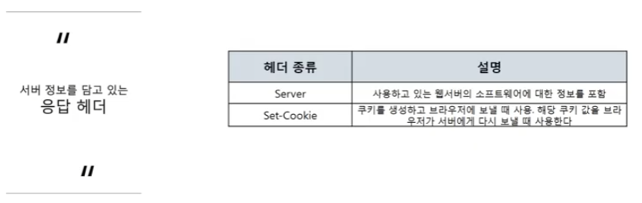

  

### [HTTP 프로토콜 분석 실습](https://youtu.be/dhMrKTwNI8U?list=PL0d8NnikouEWcF1jJueLdjRIC4HsUlULi)

-

