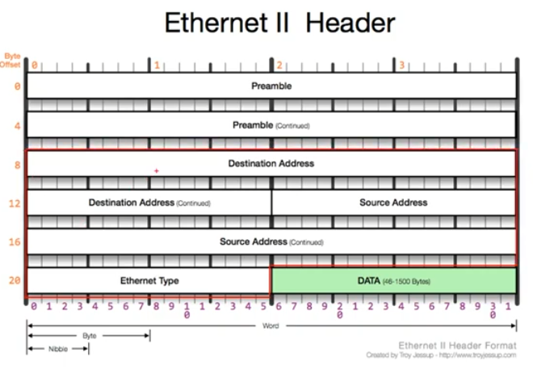

영상: [[따라學IT] 03. 가까이 있는 컴퓨터끼리는 이렇게 데이터를 주고받는다](https://youtu.be/HkiOygWMARs?list=PL0d8NnikouEWcF1jJueLdjRIC4HsUlULi)

### 2계층에서 하는일

- 2계층의 기능

  - 2계층은 하나의 네트워크 대역 즉, 같은 네트워크 상에 존재하는

    여러 장비들 중에서 어떤 장비가 어떤 장비에게 보내는 데이터를 전달

    추가적으로 오류제어, 흐름제어 수행

- 2계층의 네트워크 크기

  - 2계층은 하나의 네트워크 대역 LAN에서만 통신할 때 사용한다.

    다른 네트워크와 통신할 때는 항상 3계층이 도와주어야 한다.

    3계층의 주소와 3계층의 프로토콜을 이용하여야만 다른 네트워크와 통신이 가능하다.

### 2계층에서 사용하는 주소

- 물리적인 주소
  - LAN에서 통신할 때 사용하는 MAC 주소

### 2계층(Ethernet) 프로토콜

- Ethernet 프로토콜

  - LAN에서 통신할 때 사용하는 Ethernet 프로토콜

    

  - Destination, Source Address - MAC 주소 - 6byte

  - Ethernet Type - payload 안에 있는 상위 프로토콜 종류를 미리 알려줌

