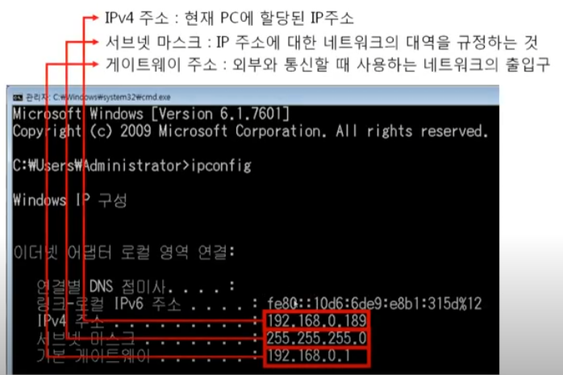
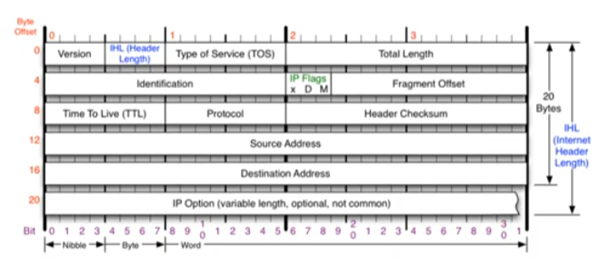
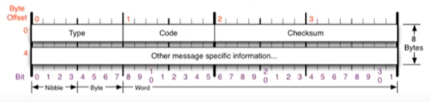
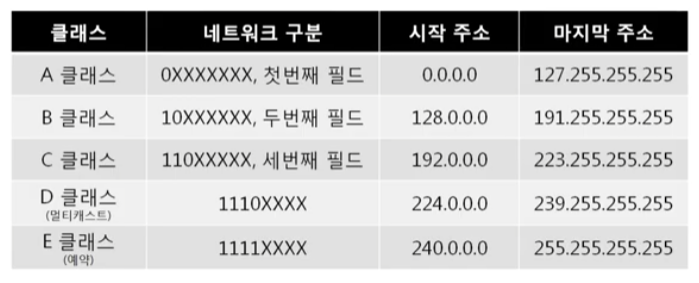
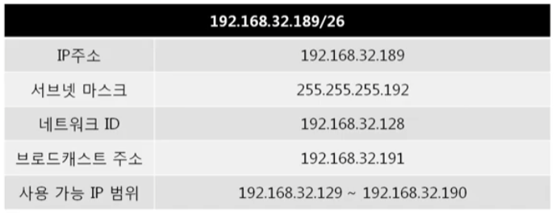
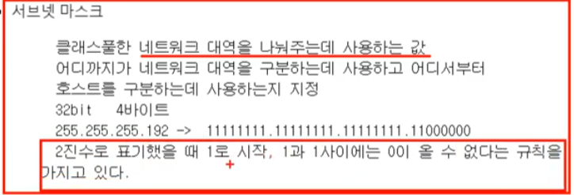
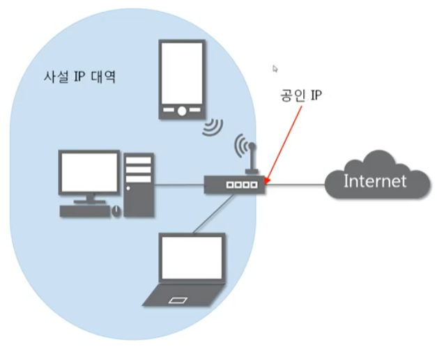

영상: [[따라學IT] 04. 실제로 컴퓨터끼리는 IP주소를 사용해 데이터를 주고받는다](https://youtu.be/s5kIGnaNFvM?list=PL0d8NnikouEWcF1jJueLdjRIC4HsUlULi)

### 3계층의 기능

- 3계층에서 하는 일

  - 3계층은 다른 네트워크 대역

    즉, 멀리 떨어진 곳에 존재하는 네트워크까지 어떻게 데이터를 전달할지

    제어하는 일을 담당

    발신에서 착신까지의 패킷의 경로를 제어

- 3계층에서 쓰는 주소

  - WAN에서 통신할 때 사용하는  **IP주소**

    

- 3계층 프로토콜

  - IP주소를 이용해 MAC주소를 알아오는 **ARP 프로토콜**

  - WAN에서 통신할 때 사용하는 **IPv4 프로토콜**

    

  - 서로가 통신되는지 확인할 때 사용하는 **ICMP 프로토콜**

    

### 일반적인 IP 주소

- Classful IP 주소

  - 낭비가 심한 Classful IP 주소

    

- Classfulless IP 주소

  - 낭비되지 않도록 아껴쓰는 **Classless IP 주소**

    

    - 서브넷 마스크

      

- 사설 IP와 공인 IP

  - 공인 IP 1개당 2^32개의 사설 IP **사설IP와 공인IP** 

    

  -  NAT - Network Address Translation - 특정 IP를 다른 IP로 전환

  - 실제 인터넷 세상에서는 공인 IP로만 통신

    외부 네트워크 대역에서는 사설IP 대역이 보이지 않는다. (※참고 포트포워딩)

### 특수한 IP 주소

- 0.0.0.0/0

  - Wildcard 0.0.0.0

    나머지...

- 127.0.0.1

  - 나 자신을 나타내는 주소

- 게이트웨이 주소

  - 어딘가로 가려면 일단 여기로 __게이트웨이 주소__

  