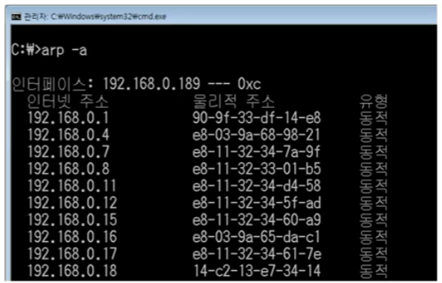

### [ARP 프로토콜](https://youtu.be/LDsp-Xb168E?list=PL0d8NnikouEWcF1jJueLdjRIC4HsUlULi)

- ARP가 하는일

  - ARP 프로토콜은 같은 네트워크 대역에서 통신을 하기 위해 필요한 MAC주소를 IP주소를 이용해서

    알아오는 프로토콜

  - 같은 네트워크 대역에서 통신을 하더라도 데이터를 보내기 위해서는 7계층부터 캡슐화를 통해

    데이터를 보내기 때문에 IP주소와 MAC주소가 모두 필요하다.

    이 때 IP주소는 아고 MAC 주소는 모르더라도 ARP를 통해 통신이 가능하다.

- ARP 프로토콜의 구조

  - IP주소를 이용해 MAC주소를 알아오는 ARP 프로토콜

    

### ARP 프로토콜의 통신 과정

- 

  

  

  

  

  

  

### ARP 테이블

- 나와 통신했던 컴퓨터들

  - 통신 했던 컴퓨터들의 주소는 ARP 테이블에 남는다.

    

    

### [ARP 프로토콜 실습](https://youtu.be/-M_S50Ga384?list=PL0d8NnikouEWcF1jJueLdjRIC4HsUlULi)

-