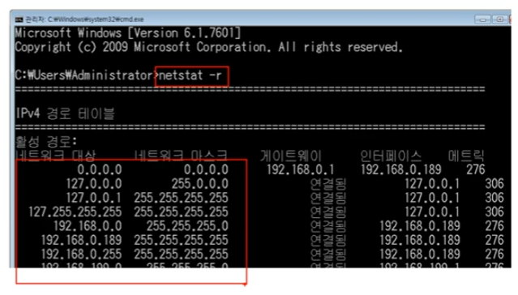

### [IPv4 프로토콜](https://youtu.be/_i8O_o2ozlE?list=PL0d8NnikouEWcF1jJueLdjRIC4HsUlULi)

- IPv4가 하는 일

  - 네트워크 상에서 데이터를 교환하기 위한 프로토콜
  - 데이터가 정확하게 전달될 것을 보장하지 않는다.
  - 중복된 패킷을 전달하거나 패킷의 순서를 잘못 전달할 가능성도 있다.
  - 데이터의 정확하고 순차적인 전달은 그보다 상위 프로토콜인 TCP에서 보장한다.

- IPv4 프로토콜의 구조

  - 다른 네트워크의 특정 대상을 찾는 IPv4 프로토콜

    

    

### [ICMP 프로토콜](https://youtu.be/JaBCIUsFE74?list=PL0d8NnikouEWcF1jJueLdjRIC4HsUlULi)

- ICMP가 하는 일

  - ICMP(Internet Control Message Protocol, 인터넷 제어 메세지 프로토콜)

  - 네트워크 컴퓨터 위에서 돌아가는 운영체제에서 오류 메세지를 전송 받는 데 주로 쓰인다.

  - 프로토콜 구조의 Type과 Code를 통해 오류 메세지를 전송 받는다.

  -  특정 대상과 내가 통신이 잘되는지 확인하는 ICMP 프로토콜

    

    Type: 8 - 요청, 0 - 응답, 3 - 목적지까지 접근 실패, 11 - 목적지 도착했지만 응답 x

### [IPv4, ICMP프로토콜 실습](https://youtu.be/8ZwTvTuZlVw?list=PL0d8NnikouEWcF1jJueLdjRIC4HsUlULi)

- 

### [라우팅 테이블](https://youtu.be/CjnKNIyREHA?list=PL0d8NnikouEWcF1jJueLdjRIC4HsUlULi)

- 내가 보낸 패킷은 어디로 가는가

  - 어디로 보내야 하는지 설정되어 있는 라우팅 테이블

    

- 다른 네트워크까지 내 패킷의 이동 과정

### [라우팅 테이블 확인 실습](https://youtu.be/tVntagSJctc?list=PL0d8NnikouEWcF1jJueLdjRIC4HsUlULi)

- 

### [IPv4 조각화 이론](https://youtu.be/_AONcID7Sc8?list=PL0d8NnikouEWcF1jJueLdjRIC4HsUlULi)

- 조각화란?

  - 큰 IP 패킷들이 적은 MTU(Maximum Transmission Unit)를 갖는 링크를 통하여 전송되려면 여러 개의 작은 패킷으로 쪼개어/조각화 되어 전송해야 한다.

  - 즉, 목적지까지 패킷을 전달하는 과정에 통과하는 각 라우터마다 전송에 적합한 프레임으로 변환이 필요

  - 일단 조각화되면, 최종 목적지에 도달할 때까지 재조립되지 않는 것이 일반적

  - IPv4에서는 발신지 뿐만 아니라 중간 라우터에서도 IP 조각화가 가능

  - IPv6에서는 IP 단편화가 발신지에서만 가능

  - 재조립은 항상 최종 수신지에서만 가능함

    

    IPv4 프로토콜 20byte 고려해야함

  - 

### [IPv4 조각화 실습](https://youtu.be/QKEL9aBgHtg?list=PL0d8NnikouEWcF1jJueLdjRIC4HsUlULi)

-