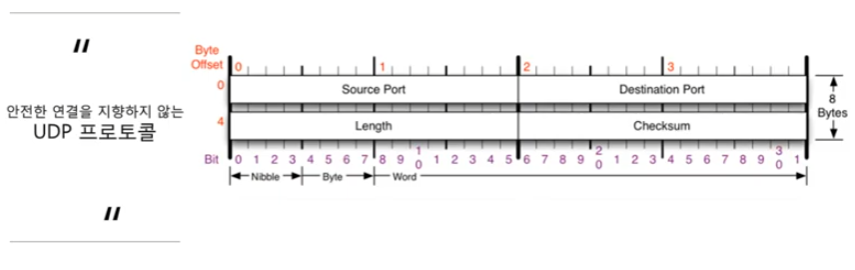
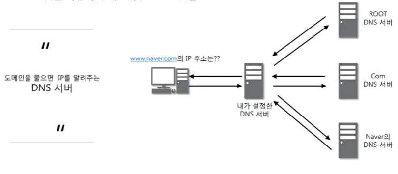
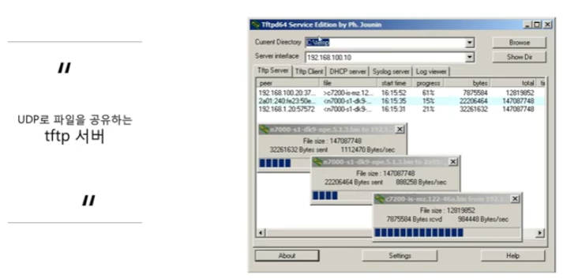
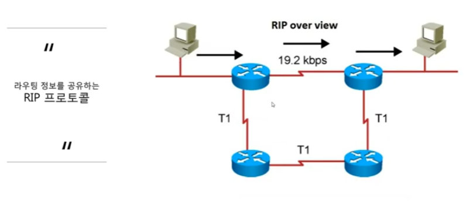

### [UDP 프로토콜](https://youtu.be/3MkI3FBFzX8?list=PL0d8NnikouEWcF1jJueLdjRIC4HsUlULi)

- UDP가 하는 일

  - 사용자 데이터그램 프로토콜(User Datagram Protocol, UDP)은 유니버설 데이터그램 프로토콜(Universal Datagram Protocol)이라고 일컫기도 한다.

  - UDP의 전송 방식은 너무 단순해서 서비스의 신뢰성이 낮고, 데이터그램 도착 순서가 바뀌거나, 중복되거나, 심지어는 통보 없이 누락시키도 한다.

  - UDP는 일반적으로 오류의 검사와 수정이 필요 없는 프로그램에서 수행할 것으로 가정한다.

    

- UDP 프로토콜을 사용하는 대표적인 프로그램들

  

  

  

  

### [tftpd로 파일 전송 실습](https://youtu.be/5Woau-EJChw?list=PL0d8NnikouEWcF1jJueLdjRIC4HsUlULi)

-

