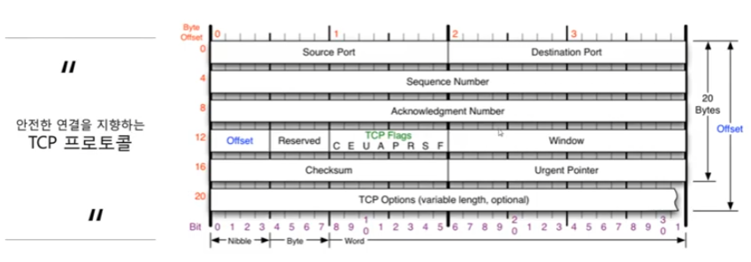
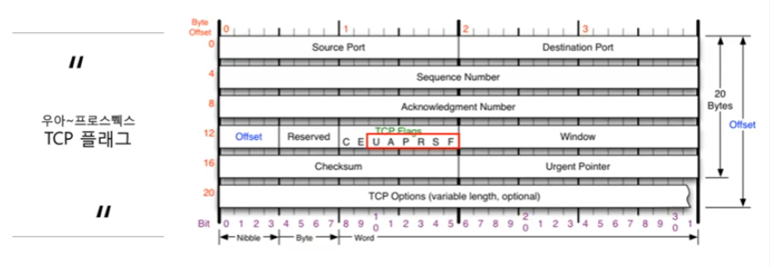
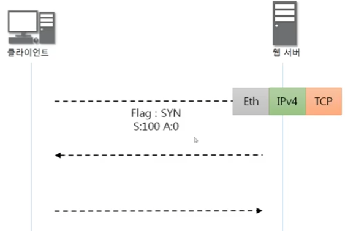
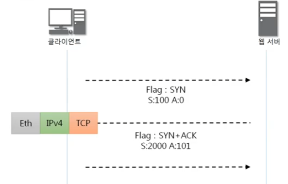
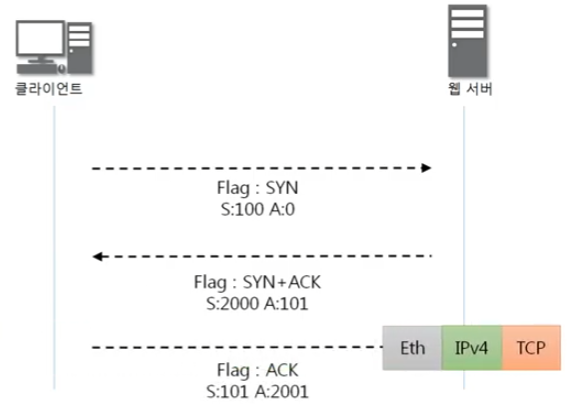
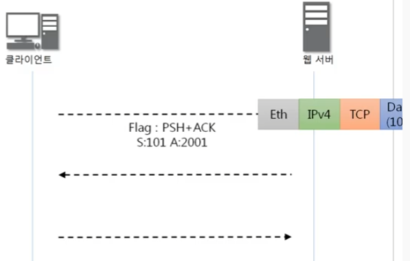
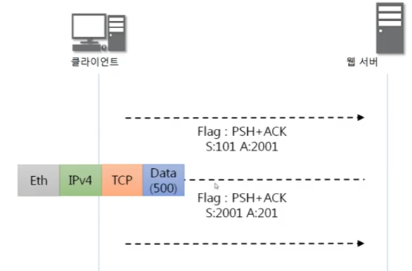
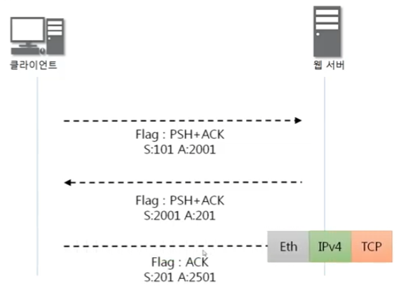
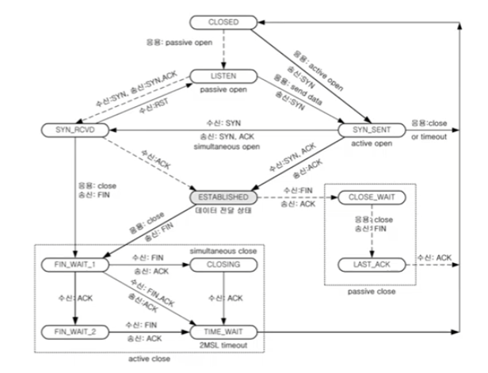
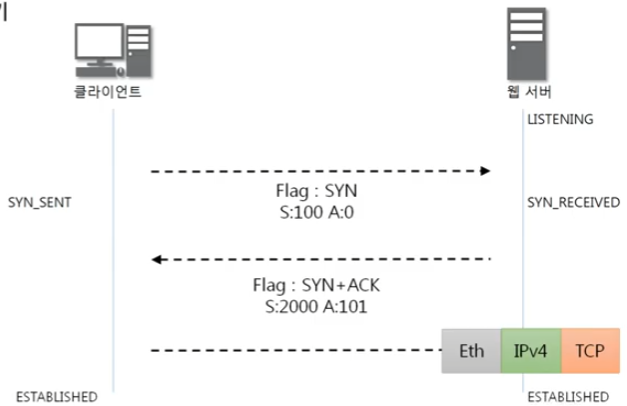

### [TCP 프로토콜](https://youtu.be/cOK_f9_k_O0?list=PL0d8NnikouEWcF1jJueLdjRIC4HsUlULi)

- TCP가 하는 일

  - 전송 제어 프로토콜(Transmission Control Protocol, TCP)은 인터넷에 연결된 컴퓨터에서 실행되는 프로그램 간에 통신을 안정적으로, 순서대로, 에러없이 교환할 수 있게 한다.

  - TCP의 안정성을 필요로 하지 않는 에플리케이션의 경우 일반적으로 TCP 대신 비접속형 사용자 데이터그램 프로토콜 (User Datagram Protocol)을 사용한다.

  - TCP는 UDP보다 안전하지만 느리다.

    

    Offset - header 길이 / 4

### TCP 플래그

- TCP 플래그의 종류

  

  U - Urgent Flag - 우선순위

  Urgent Pointer - 우선순위 데이터 위치를 나타냄

  **A** - Acknowledgment - 응답 승인 비트

  P - Push Flag - TCP 버퍼 상관없이 데이터를 밀어 넣겠다..

  **R** - Reset 비트 - 관계 초기화

  **S** - Synk 비트 - 동기화 비트 - 연결 시작 시 사용하는 플래그

  **F** - Fin 비트 - 연결 끊을 시 사용하는 플래그

### [TCP 3Way Handshake](https://youtu.be/Ah4-MWISel8?list=PL0d8NnikouEWcF1jJueLdjRIC4HsUlULi)

- 연결 수립 과정

  - TCP를 이용한 데이터 통신을 할 때 프로세스와 프로세스를 연결하기 위해 가장 먼저 수행되는 과정

    1. 클라이언트가 서버에게 요청 패킷을 보내고
    2. 서버가 클라이언트의 요청을 받아들이는 패킷을 보내고
    3. 클라이언트는 이를 최종적으로 수락하는 패킷을 보낸다.

    위의 3개의 과정을 3Way Handshake라고 부른다.

  

  

  

  

### [TCP를 이용한 데이터 전송 과정](https://youtu.be/0vBR666GZ5o?list=PL0d8NnikouEWcF1jJueLdjRIC4HsUlULi)

- 데이터 송수신 과정
  - TCP를 이용한 데이터 통신을 할 때 단순히 TCP 패킷만을 캡슐화해서 통신하는 것이 아닌 페이로드를 포함한 패킷을 주고 받을 때의 일정한 규칙
    1. 보낸 쪽에서 또 보낼 때는 SEQ번호와 ACK번호가 그대로다.
    2. 받는 쪽에서 SEQ번호는 받은 ACK번호가 된다.
    3. 받는 쪽에서 ACK번호는 받은 SEQ번호 + 데이터의 크기

### [TCP의 연결 상태 변화](https://youtu.be/yY0uQf0BTH8?list=PL0d8NnikouEWcF1jJueLdjRIC4HsUlULi)

- TCP 연결 상태의 변화

  

  실선 - 클라이언트의 상태 변화, 점선 - 서버의 상태 변화

  **LISTEN** - 포트 번호를 열어놓고 있는 상태 (서버에서 포트번호 사용하고 있는 상태)

  **ESTABLISHED** - 연결이 서로 수립이 되어있는 상태

### [TCP 프로토콜 분석 실습](https://youtu.be/WseqBDo-j3Y?list=PL0d8NnikouEWcF1jJueLdjRIC4HsUlULi)

-

