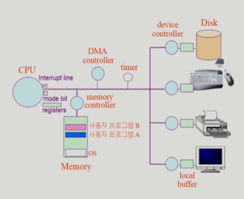

영상: [운영체제](http://www.kocw.net/home/search/kemView.do?kemId=1046323)

## [1 운영체제 개요](https://core.ewha.ac.kr/publicview/C0101020140307151724641842?vmode=f)

### 운영 체제란?

- 컴퓨터 하드웨어 바로 위에 설치되어 사용자 및 다른 모든 SW와 HW를 연결하는 SW 계층
- 협의의 운영체제(커널)
  - 운영체제의 핵심 부분으로 메모리에 상주하는 부분
- 광의의 운영체제
  - 커널 뿐 아니라 각종 주변 시스템 유틸리티를 포함한 개념

### 운영 체체의 목적

- 컴퓨터 시스템의 **자원을 효율적으로 관리**
  - CPU, 메모리, I/O 장치 등의 효율적 관리
  - 사용자 및 운영체제 자신의 보호
  - 프로세스, 파일, 메세지 등을 관리

- 컴퓨터 시스템을 편리하게 사용할 수 있는 환경을 제공
  - 운영체제는 동시 사용자/ 프로그램들이 각각 독자적 컴퓨터에서 수행되는 것 같은 환상을 제공
  - 하드웨어를 직접 다루는 복잡한 부분을 운영체제가 대행

### 운영 체제의 분류

- 동시 작업 가능 여부
  - 단일 작업
  - 다중 작업
- 사용자의 수
  - 단일 사용자 
    - MS-DOS, MS Windows
  - 다중 사용자
    - UNIX, NT server
- 처리 방식
  - 일괄 처리
    - 작업 요청의 일정량 모아서 한꺼번에 처리
    - 작업이 완전 종료될 때까지 기다려야 함
  - 시분할
    - 여러 작업을 수행할 때 컴퓨터 처리 능력을 일정한 시간 단위로 분할하여 사용
    - 일괄 처리 시스템에 비해 짧은 응답 시간을 가짐
  - 실시간
    - 정해진 시간 안에 어떠한 일이 반드시 종료됨이 보장되어야 하는 실시간 시스템을 위한 OS
    - 원자로 / 공장 제어, 미사일 제어, 반도체 장비, 로보트 제어

### 몇 가지 용어

- Multitasking
- Multiprogramming
- Time Sharing
- Multiprocess
- 구분
  - 위의 용어들은 컴퓨터에서 여러 작업을 동시에 수행하는 것을 뜻한다.
  - Multiprogramming은 여러 프로그램이 메모리에 올라가 있음을 강조
  - Time Sharing은 CPU의 시간을 분할하여 나누어 쓴다는 의미를 강조
- Multiprocessor
  - 하나의 컴퓨터에 CPU가 여러 개 붙어 있음을 의미

### 운영 체제의 예

- UNIX
  - 코드의 대부분을 C언어로 작성
  - 높은 이식성
  - 최소한의 커널 구조
  - 복잡한 시스템에 맞게 확장 용이
  - 소스 코드 공개
  - 프로그램 개발에 용이
  - 다양한 버전
    - System V, FreeBSD, SunOS, Solaris, Linux
- MS Windows
  - MS사의 다중 작업용 GUI 기반 운영 체제
  - Plug and Play, 네트워크 환경 강화
  - DOS용 응용 프로그램과 호환성 제공
  - 불안정성
  - 풍부한 지원 소프트웨어

### 운영 체제의 구조

- CPU 스케쥴링, 메모리 관리, 파일 관리 등등

## [2 시스템 구조 및 프로그램의 실행 Part-1](https://core.ewha.ac.kr/publicview/C0101020140311132925816476?vmode=f)

### 컴퓨터 시스템 구조

- 
- mode bit - 메모리에서 꺼내오는게 OS인지 프로그램인지 구분
- timer - 특정 프로그램 독점 막는 기능 (할당 시간 이상 CPU 독점시 interrupt)
- 모든 I/O 접근은 OS를 통해서만 가능

### Mode bit

- 사용자 프로그램의 잘못된 수행으로 다른 프로그램 및 OS에 피해가 가지 않도록 하기 위한 보호 장치 필요
- Mode bit을 통해 하드웨어적으로 두 가지 모드의 operation 지원
  - 1 사용자 모드: 사용자 프로그램 수행
  - 0 모니터 모드: OS 코드 수행
    - 보안을 해칠 수 있는 중요한 명령어는 모니터 모드에서만 수행 가능한 **특권명령**으로 규정
    - interrupt나 exception 발생시 하드웨어가 mode bit을 0으로 바꿈
    - 사용자 프로그램에게 CPU를 넘기기 전에 mode bit을 1로 셋팅

### Timer

- 타이머
  - 정해진 시간이 흐른 뒤 운영체제에게 제어권이 넘어가도록 인터럽트를 발생시킴
  - 타이머는 매 클럭 틱 때마다 1씩 감소
  - 타이머 값이 0이 되면 타이머 인터럽트 발생
  - CPU를 특정 프로그램이 독점하는 것으로부터 보호
- 타이머는 time sharing을 구현하기 위해 널리 이용됨
- 타이머는 현재 시간을 계산하기 위해서도 사용

### Device Controller

- I/O device controller
  - 해당I/O 장치유형을 관리하는 일종의 작은 CPU
  - 제어 정보를 위해 control register, status register를 가짐
  - local buffer를 가짐 (일종의 data register)
- I/O는 실제 device와 local buffer 사이에서 일어남
- Device controller는 I/O가 끝났을 경우 intterupt로 CPU에 그 사실을 알림

- device driver (장치 구동기)
  - OS 코드 중 각 장치별 처리루틴 -> SW
- device controller (장치 제어기)
  - 각 장치를 통제하는 일종의 작은 CPU -> HW

### [입출력과 인터럽트 (Input-Output and Interrupt)](컴퓨터-구조/5장-기본-컴퓨터의-구조와-설계-Part2/입출력과-인터럽트.md)

- 인터럽트
  - 인터럽트 당한 시점의 레지스터와 program counter를 save한 후 CPU의 제어를 인터럽트 처리 루틴에 넘긴다
- interrupt (넓은 의미)
  - innterrupt(하드웨어 인터럽트): 하드웨어가 발생시킨 인터럽트
  - Trap(소프트웨어 인터럽트)
    - Exception: 프로그램이 오류를 범한 경우
    - System call: 프로그램이 커널 함수를 호출하는 경우
- 인터럽트 관련 용어
  - 인터럽트 벡터
    - 해당 인터럽트의 처리 루틴 주소를 가지고 있음
  - 인터럽트 처리 루틴
    - 해당 인터럽트를 처리하는 커널 함수

- 모든 입출력 명령은 특권 명령
- 사용자 프로그램은 어떻게 I/O를 하는가
  - 시스템 콜
    - 사용자 프로그램은 운영체제에게 I/O 요청
  - trap을 사용하여 인터럽트 벡터의 특정 위치로 이동
  - 제어권이  인터럽트 벡터가 가리키는 인터럽트 서비스 루틴으로 이동
  - 올바른 I/O 요청인지 확인 후 I/O 수행
  - I/O 완료 시 제어권을 시스템콜 다음 명령으로 옮김

### 시스템 콜 (System Call)

- 사용자 프로그램이 운영체제의 서비스를 받기 위해 커널 함수를 호출하는 것

## [2 시스템 구조 및 프로그램의 실행 Part-2](https://core.ewha.ac.kr/publicview/C0101020140314151238067290?vmode=f)

### 동기식 입출력과 비동기식 입출력

- 

### DMA (Direct Memory Access)

- 

### 서로 다른 입출력 명령어

- 

### 저장장치 계층 구조

- [12장 메모리 구조](컴퓨터-구조/12장-메모리-구조/12장-메모리-구조.md) 

### 프로그램의 실행 (메모리 load)

- 

### 커널 주소 공간의 내용

- 

### 사용자 프로그램이 사용하는 함수

-