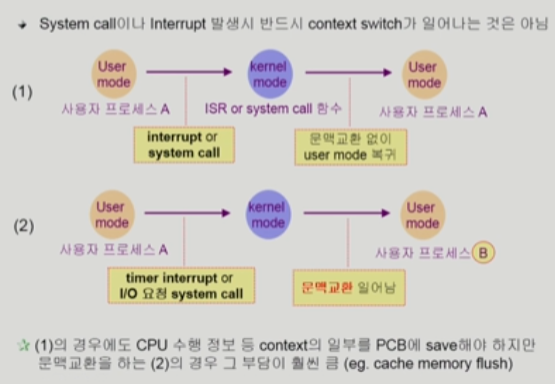
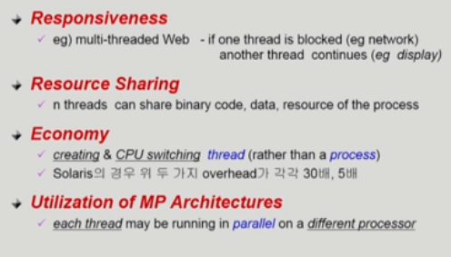
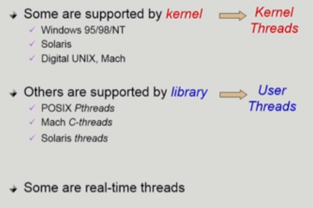

## [프로세스 #1](https://core.ewha.ac.kr/publicview/C0101020140318134023355997?vmode=f)

### 프로세스의 개념

- Process is a program in execution

- 프로세스의 문맥(context)

  - CPU 수행 상태를 나타내는

    하드웨어 문맥

    - Program Counter
    - 각종 register

  - 프로세스의 주소 공간

    - code, data, stack

  - 프로세스 관련 커널 자료 구조

    - PCB(Process Control Block)
    - Kernel stack

### 프로세스의  상태 (Process State)

- 프로세스는 상태(state)가 변경되며 수행된다.

  - Running

    - CPU를 잡고 instruction을 수행중인 상태

  - Ready

    - CPU를 기다리는 상태(메모리 등 다른 조건을 모두 만족하고)

  - Blocked(wait, sleep)

    - CPU를 주어도 당장 instruction을 수행할 수 없는 상태
    - Process 자신이 요청한 event(ex: I/O)가 즉시 만족되지 않아 이를 기다리는 상태
    - ex) 디스크에서 file을 읽어와야 하는 경우

  - New

    - 프로세스가 생성중인 상태

  - Terminiated

    - 수행(execution)이 끝난 상태

  - Suspended (stopped)

    - 외부적인 이유로 프로세스의 수행이 정지된 상태

    - 프로세스는 통째로 디스크에 swap out 된다

    - ex) 사용자가 프로그램을 일시 정지시킨 경우 (break key)

      사스템이 여러 이유로 프로세스를 잠시 중단시킴

      (메모리에 너무 많은 프로세스가 올라와 있을 때)

- Blocked: 자신이 요청한 event가 만족되면 ready

- Suspended: 외부에서 resume해 주어야 active

### Process Control Block(PCB)

- 운영체제가 각 프로세스를 관리하기 위해 프로세스당 유지하는 정보
- 다음의 구성 요소를 가진다 (구조체로 유지)
  1. OS가 관리상 사용하는 정보
     - Process sate, Process ID
     - scheduling information, priority
  2. CPU 수행 관련 하드웨어 값
     - Program counter, register
  3. 메모리 관련
     - Code, data, stack의 위치 정보
  4. 파일 관련
     - Open file descriptors

### 문맥 교환 (Context Switch)

- CPU를 한 프로세스에서 다른 프로세스로 넘겨주는 과정
- CPU가 다른 프로세스에게 넘어갈 때 운영체제는 다음을 수행
  - CPU를 내어주는 프로세스의 상태를 그 프로세스의 PCB에 저장
  - CPU를 새롭게 얻는 프로세스의 상태를 PCB에서 읽어옴

### 프로세스를 스케줄링하기 위한 큐

- Job Queue
  - 현재 시스템 내에 있는 모든 프로세스의 집합
- Ready Queue
  - 현재 메모리 내에 있으면서 CPU를 잡아서 실행되기를 기다리는 프로세스의 집합
- Device Queue
  - I/O device의 처리를 기다리는 프로세스의 집합
- 프로세스들은 각 큐들을 오가며 수행된다

### 스케줄러 (Scheduler)

- Long-term scheduler(장기 스케쥴러 or job scheduler)
  - 시작 프로세스 중 어떤 것들을 ready queue로 보낼지 결정
  - 프로세스에 memory(및 각종 자원)을 주는 문제
  - degree of Multiprogramming을 제어
  - time sharing system에는 보통 장기 스케쥴러가 없음
- Short-term  scheduler(단기 스케쥴러 or CPU scheduler)
  - 어떤 프로세스를 다음번에 running시킬지 결정
  - 프로세스에 CPU를 주는 문제
  - 충분히 빨라야 함(ms 단위)
- Medium-Term scheduler(중기 스케쥴러 or Swapper)
  - 여유 공간 마련을 위해 프로세스를 통째로 메모리에서 디스크로 쫓아냄
  - 프로세스에게서 memory를 뺏는 문제
  - degree of Multiprogramming을 제어

## [프로세스 #2](https://core.ewha.ac.kr/publicview/C0101020140321141759959993?vmode=f)

### 질문 답변 > [1, 2장 운영체제 개요 및 컴퓨터시스템의 구조](운영체제/1,-2장-운영체제-개요-및-컴퓨터시스템의-구조.md)

### Thread

- A thread (or lightweight process)is a basic unit of CPU utilization
- Thread의 구성
  - program counter
  - register set
  - stack space
- Thread가 동료 thread와 공유하는 부분
  - code section
  - data section
  - OS resources
- 전통적인 개념의 heavyweight process는 하나의 thread를 가지고 있는 task로 볼 수 있다.
- 다중 스레드로 구성된 태스크 구조에서는 하나의 서버 스레드가 blocked 상태인 동안에도 동일한 태스크 내의 다른 스레드가 실행되어 빠른 처리를 할 수 있다.
- 동일한 일을 수행하는 다중 스레드가 협력하여 높은 처리율과 성능 향상을 얻을 수 있다.
- 스레드를 사용하면 병렬성을 높일 수 있다.

## 프로세스 #3

### Single and Multithreaded Processes

- 

### Benefits of Threads

- 

### Implementation of Threads

- 