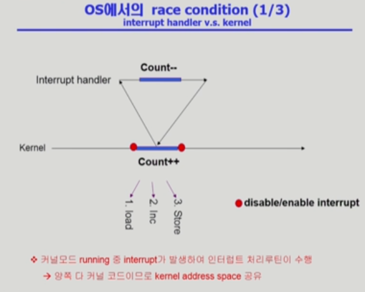
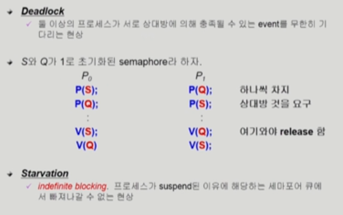

## CPU Scheduling

- 

- 

- 

- 

- 

- 

- 

- 

  

## [프로세스 동기화 #1](https://core.ewha.ac.kr/publicview/C0101020140401134252676046?vmode=f)

39분 부터 시작

### 데이터의 접근

- 

### Race Condition

- 

### OS에서의 Race Condition

- kernel 수행 중 인터럽트 발생 시
  - 
- Process가 system call을 하여 kernel mode로 수행 중인데 context switch가 일어나는 경우
  - 
- Multiprocessor에서 shared memory 내의 kernel data
  - 

### Process Synchronization 문제

- 

- Example of a Race Condition
  - 
- The Critical-Section Problem
  - 

### 프로그램적 해결법의 충족조건

- Initial Attempts to Solve Problem
  - 

## [프로세스 동기화 #2](https://core.ewha.ac.kr/publicview/C0101020140404151340260748?vmode=f)

### Semaphores

- 

### Critical Section of n Processes

- 

### Block / Wakeup Implementation

- 
- 
- 

### Two Types of Semaphores

- 

### Deadlock and Starvation

- 

## [프로세스 동기화 #3](https://core.ewha.ac.kr/publicview/C0101020140408134626290222?vmode=f)

## [프로세스 동기화 #4](https://core.ewha.ac.kr/publicview/C0101020140411143154161543?vmode=f)

### Classical Problems of Syncronization

- Bounded-Buffer Problem (Producer-Consumer Problem)
- Readers-Writers Problem
- Dining-Philosophers Problem

### Monitor

-