## [교착상태 #1](https://core.ewha.ac.kr/publicview/C0101020140411151510275738?vmode=f)

## [교착상태 #2](https://core.ewha.ac.kr/publicview/C0101020140415131030840772?vmode=f)

### The Deadlock Problem

- 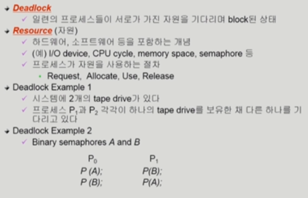

### Deadlock 발생의 4가지 조건

- 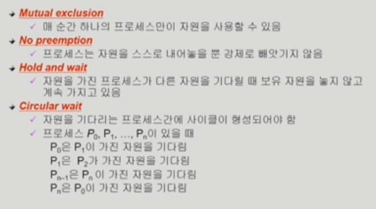

### Resource-Allocation Graph(자원할당그래프)

- 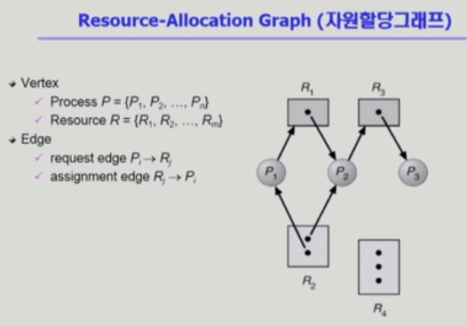
- 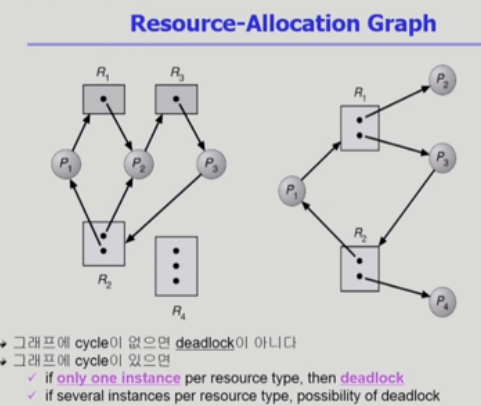

### Deadlock의 처리 방법

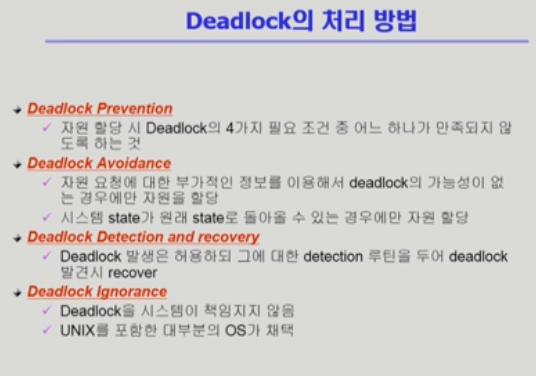

- Deadlock Prevention

  - 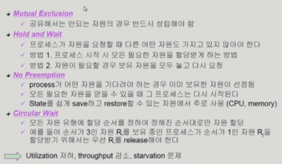

- Deadlock Avoidance

  - 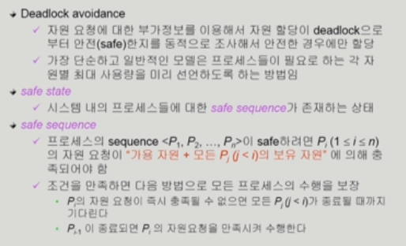

    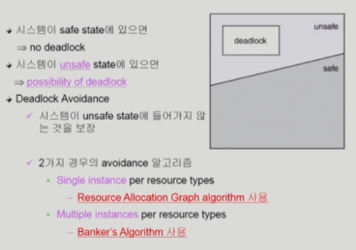

  - Resource Allocation Graph algorithm

    - 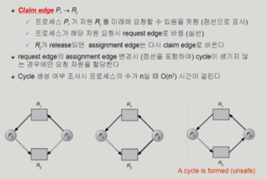

  - Example of Banker's Algorithm

    - 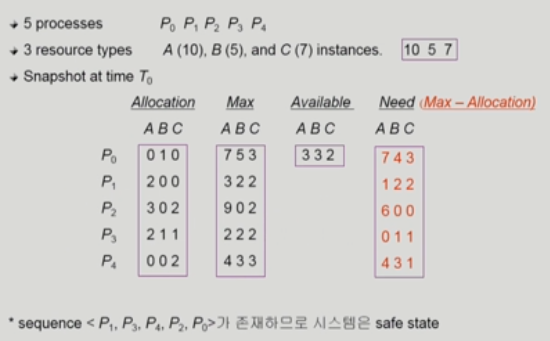
    - 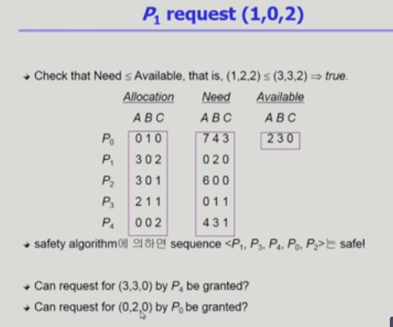

- Deadlock Detection and recovery

  - 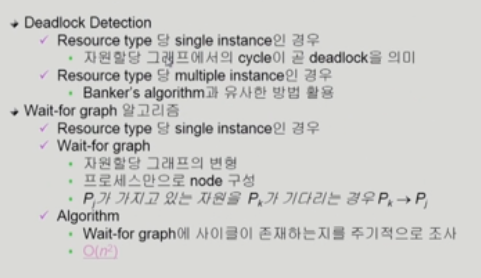
  - 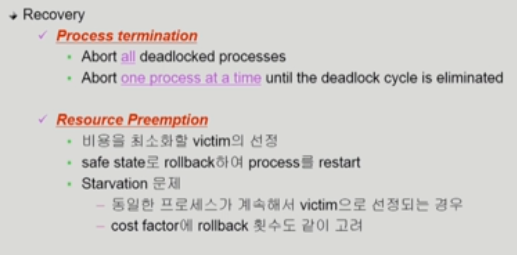

- Deadlock Ignorance

  - 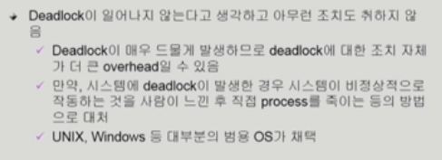

