## [메모리 관리 #1](https://core.ewha.ac.kr/publicview/C0101020140425151219100144?vmode=f)

### Logical vs. Physical Address

- 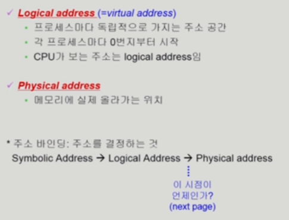

### 주소바인딩(Address Binding)

- 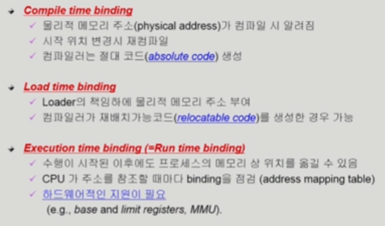

  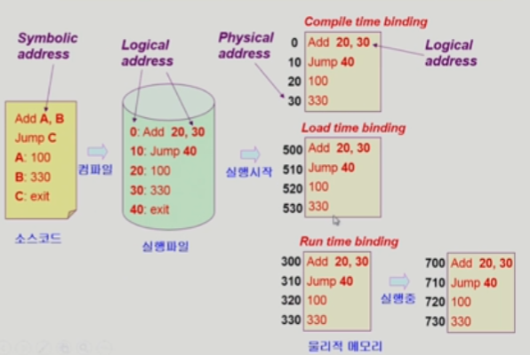

### Memory-Management Unit(MMU)

- 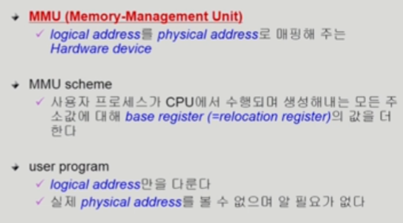

### Dynamic Relocation

- 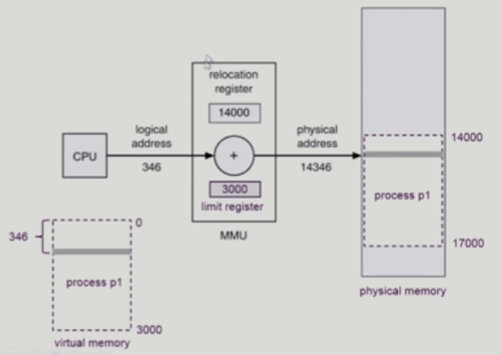

### Hadware Support for Address Translation

- 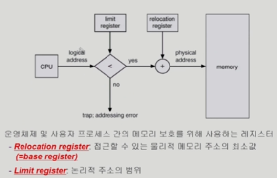

### Some Treminologies

- Dynamic Loading
  - 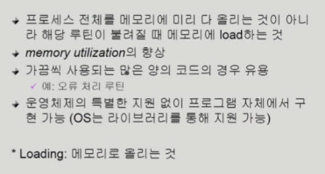
- Dynamic Linking
  - 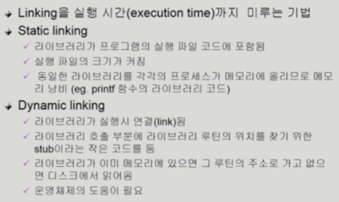
- Overlays
  - 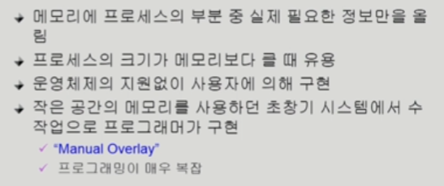
- Swapping
  - 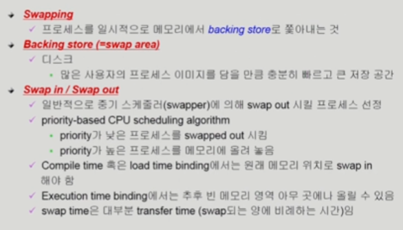

## [메모리 관리 #2](https://core.ewha.ac.kr/publicview/C0101020140429132440045277?vmode=f)

## [메모리 관리 #3](https://core.ewha.ac.kr/publicview/C0101020140502151452123728?vmode=f)

[Paging](운영체제/8장-메모리-관리/Paging.md) 

## [메모리 관리 #4](https://core.ewha.ac.kr/publicview/C0101020140509142939477563?vmode=f)

[Segmentation](운영체제/8장-메모리-관리/Segmentation.md) 

### Allocation of Physical Memory

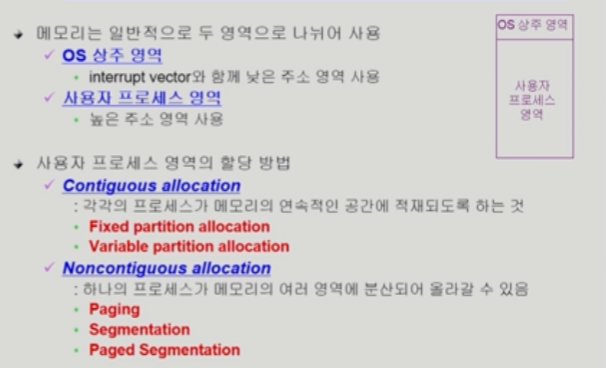

- Contiguous allocation (연속 할당)

  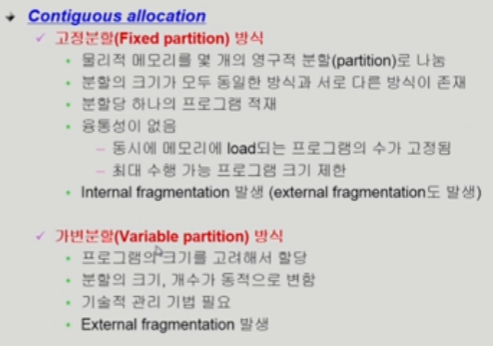

  - 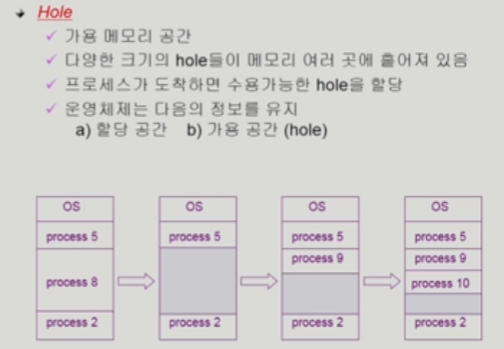
  - 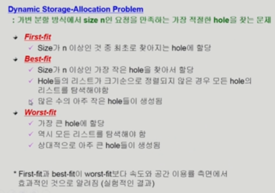
  - 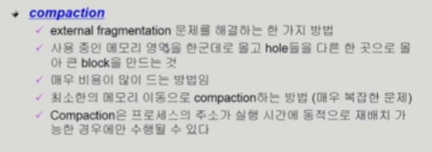

- NonContiguous allocation
  - [Paging](운영체제/8장-메모리-관리/Paging.md)
    - 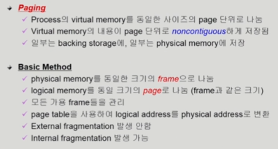
  - [Segmentation](운영체제/8장-메모리-관리/Segmentation.md)
  - Paged Segmentation