영상: [컴퓨터시스템구조(M.M.Mano 3rd)](https://www.youtube.com/playlist?list=PLc8fQ-m7b1hD4jqccMlfQpWgDVdalXFbH)

## 강의 소개
- 

## 제 1장 Part-1

### 디지털 컴퓨터(Digitial Computer)

- 정의
  - 이진 시스템을 사용하여 계산을 수행하는 디지털 시스템
  - 비트의 그룹을 사용하여 숫자, 문자 및 기타 정보를 표시하거나 처리
- 컴퓨터 하드웨어
  - **CPU (Centeral Processing Unit)** - 중앙처리장치. 산술 논리 처리와 데이터의 저장, 제어 기능 수행
  - 주변장치 - 메모리(RAM/ROM), 저장 장치(Storage), 입출력 장치(IO devices)
- 컴퓨터 소프트웨어
  - 운영체제
    - OS - Operating System
  - 시스템프로그램
    - 유틸리티, 데이터베이스, Editor
    - OS에 포함되거나 연결되어 시스템 운영을 보조
  - 응용프로그램

### 논리 게이트(Logic Gates)
- 이진 정보의 표시

  - 0과 1의 전압 신호
  - (0V - 5V) 시스템
  - (0.5V - 3V) 시스템

- 논리 게이트

  - 기본 게이트

  - 진리표로 동작 정의

    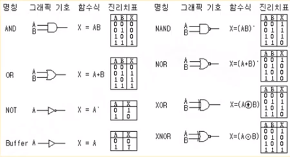

### [부울 대수(Boolean Algebra)](이산-수학/명제,추론,귀납,부울대수/부울-대수.md)

- 이진 변수와 논리 동작을 취급하는 대수

- 기본 대수 동작 : AND, OR, NOT

- 부울 대수의 예

  - F = x + y' z

- 부울 대수의 사용 이유

  - 변수 사이의 진리표 관계를 대수적으로 표시
  - 논리도의 입출력 관계를 대수 형식으로 표시
  - 같은 기능을 가진 더 간단한 회로 발견

- 부울 대수의 기본 관계

  - 항등원
  - 역원
  - 교환법칙
  - 결합법칙
  - 드모르간의 법칙

- 부울 대수의 간략화와 등가 회로

  - F = ABC + ABC' + A'C = AB(C + C') + A'C

    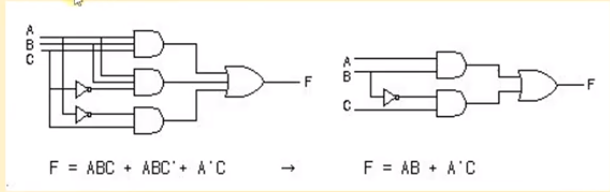

- 부울 대수의 보수

  - F = AB + C'D' + B'D
  - F = (A' + B')(C + D)(B + D')

## [제 1장 Part-2](https://youtu.be/9ZtZTTN7Y-g?list=PLc8fQ-m7b1hD4jqccMlfQpWgDVdalXFbH)

### 맵의 간소화 (Karnaugh Map)
- [4강 동치 관계](이산-수학/이산수학-기초/동치-관계.md)

- 맵 방식의 부울 수식 간소화

- Karnaugh map, Veitch diagram

- Minterm, Maxterm을 이용한 간소화

  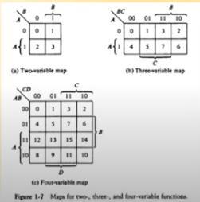

- 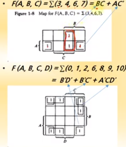

- 논리합의 논리곱

  - 1 항의 간소화

  - 0 항의 간소화

    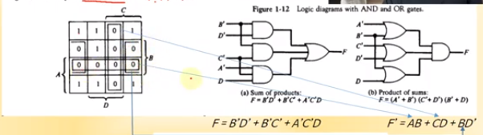

- 무정의 조건 (Don't Care Condition)

  - 사용하지 않는 항을 활용하여 간소화

    F = A' + BC'

    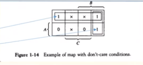

    

## [제 1장 Part-3](https://youtu.be/9145l3C3Cc4?list=PLc8fQ-m7b1hD4jqccMlfQpWgDVdalXFbH)

### 조합회로 (Combinational Circuit)
- 정의

  - 입력과 출력을 가진 논리 게이트의 집합
  - 출력의 값은 입력의 0, 1의 조합에 의하여 결정되는 함수의 결과로 표시
  - n 개의 입력 조합이 있을 경우 가능한 입력 조합 : $$2^n$$ 가지

- 조합 회로의 설계 절차

  1. 해결할 문제의 제시
  2. 입력과 출력의 변수에 문자 기호 부여
  3. 입력 - 출력 관계를 정의하는 진리표 도출
  4. 각 출력에 대한 간소화된 부울 함수 도출
  5. 부울 함수에 대한 논리도 작성
  6. 논리도를 바탕으로 회로 구현

- 반가산기(Half adder)

  - 2 개의 비트값을 산술적으로 가산

  - S = x'y + xy' = x XOR y

  - C = xy

    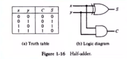

- 전가산기(Full adder)

  - 캐리값을 포함하여 3비트 가산

  - S = x XOR y XOR z

  - C = xy + (x XOR y)z

    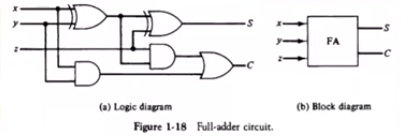

## [제 1장 Part-4](https://youtu.be/zf0p0qegnzQ?list=PLc8fQ-m7b1hD4jqccMlfQpWgDVdalXFbH)

### 플립플롭 (Flip-Flop)
- 정의

  - 1 비트의 디지털 정보를 저장하는 이진 셀 (디지털 메모리)
  - 동기식 순차회로의 기본적인 요소로 사용, 조합회로와 함께 순차회로를 구성
  - 입력의 상태가 변화를 일으키기 전까지는 이전의 출력 상태를 그대로 유지

- 플리플롭의 종류

  - SR-플리플롭
  - D-플리플롭
  - JK-플리플롭
  - T-플리플롭

  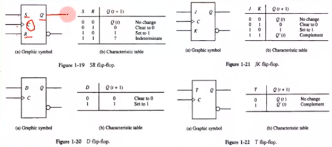

- 모서리 - 변이형 플리플롭(Edge-triggered FF)

  - 입력값의 변화 모서리에서만 동작

    - Upward triggered FF
      - 입력값이 상향일 경우에만 동작(0 -> 1)
    - Downward triggered FF
      - 입력값이 하향일 경우에만 동작 (1 -> 0)

  - 올바른 동작을 위해서는 최소의 신호 유지 시간 필요

    - Setup time
      - 출력 변화를 위하여 입력이 유지되어야 하는 최소 시간
    - Hold time
      - 출력 유지를 위하여 입력이 바뀌지 않아야 하는 최소 시간

    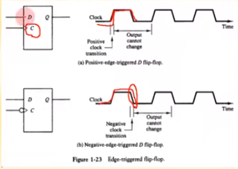

    

## [제 1장 Part-5](https://youtu.be/h2y8a11wrNc?list=PLc8fQ-m7b1hD4jqccMlfQpWgDVdalXFbH)

### 순차회로 (Sequential Circuit)
- 정의
  - 플리플롭과 게이트(또는 조합회로)를 서로 연결한 회로
  - 클럭펄스에 의하여 동기화된 입력 순차에 의하여 제어
  - 출력은 외부 입력과 플리플롭의 현 상태의 함수로 표시
- 플리플롭의 입력식
  - FF의 입력을 만들어내는 조합 회로 부분
  - 부울 수식에 의하여 표현
  - 상태표 (State Table)
  - 상태도 (State Diagram)

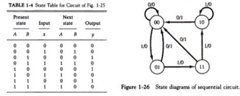

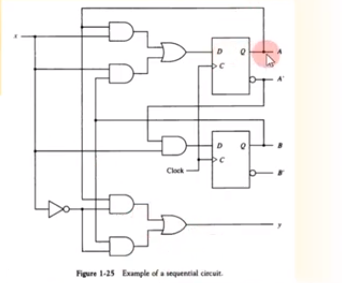

- 순차회로의 설계 예

  - 2비트 2진카운터의 설계
    1. 상태표, 상태도 작성
    2. 순차회로 여기표 작성
    3. 플리플롭의 선택과 입력식 도출
    4. 회로도 구현

  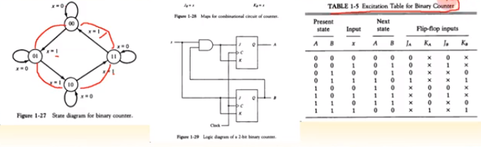

- 
