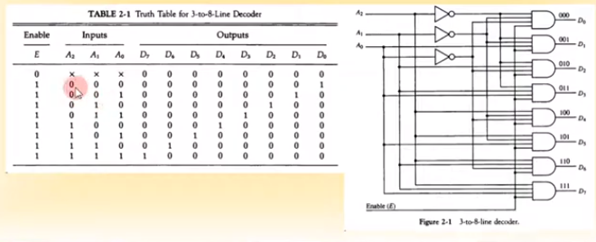

영상: [컴퓨터시스템구조 CSA 제2장 Part-1](https://youtu.be/KKkhZkVAJWQ?list=PLc8fQ-m7b1hD4jqccMlfQpWgDVdalXFbH)

## [제 2장 Part-1, 2](https://youtu.be/OMPluhHkGSg?list=PLc8fQ-m7b1hD4jqccMlfQpWgDVdalXFbH)

### 집적회로 (Integrated Circuits)

- 정의
  - 디지털 게이트를 구성하는 전자 부품을 포함하는 실리콘 반도체 칩(Chip)
  - 칩 내부에 게이트들이 연결되고, 외부로도 연결
  - 칩의 등록번호로 구분(dataBook을 통하여 정보 확인 가능)
- 집적 규모에 따른 분류
  - SSI - 소규모, 10개 이하의 게이트들로 구성
  - MSI - 중규모, 10~200개의 게이트들로 디코더, 가산기, 레지스터 구현
  - LSI - 대규모, 200~1000개의 게이트들로 프로세서나 메모리 칩과 같은 디지털 시스템 형성
  - VLSI - 초대규모, 수천개 이상의 게이트 집적, 대형 메모리나 마이크로컴퓨터 칩 구성

- 디지털 논리군
  - TTL : Transister-Transistor Logic
    - 일반 로직 회로 부품
  - ECL : Emitter-Coupled Logic
    - 고속 논리 시스템용 부품, 슈퍼컴퓨터용
  - MOS : Metal Oxide Semiconductor
    - 고밀도 집적회로용 부품
  - CMOS : Complement Metal Oxide Semiconductor
    - 고밀도 회로, 단순한 제조공정, 저전력 특성

## [제 2장 Part-3](https://youtu.be/HRtwaJUQ5hA?list=PLc8fQ-m7b1hD4jqccMlfQpWgDVdalXFbH)

### 디코더 (Decoders)

- N 비트의 이진 정보를 서로 다른 2^N 개의 원소 정보로 출력

  - 2개의 입력 -> 4가지 출력 : 2 * 4 decoder
  - 3개의 입력 -> 8가지 출력 : 3 * 8 decoder

  

- NAND 게이트로 이루어진 디코더

  - 보수화된 출력이 더 경제적임
  - 대부분의 출력신호가 1로 유지
  - CMOS 회로의 영향으로 저전력 회로에 유리

- 인코더

  - 디코더와 반대 동작 수행
  - 2^N 의 입력에 대하여 N 이진 코드 출력
  - 한번에 하나의 입력만이 1의 값을 가질 수 있음

  

### 멀티플렉서 (Multiplexers)

- 정의
  - N개의 선택 입력에 따라서 2^N 개의 출력을 하나의 출력에 선택적으로 연결
  - 다중 입력 중 하나를 선택하여 출력으로 연결
  - 네트워크 스위치 (전화, LAN, WAN)의 기본 구조 요소

## [제 2장 Part-4](https://youtu.be/G92HtFxC-6Q?list=PLc8fQ-m7b1hD4jqccMlfQpWgDVdalXFbH)

### 레지스터 (Registers)

- 

### 시프트 레지스터 (Shift Registers)

- 

### 이진 카운터 (Binary Counters)

- 

## [제 2장  Part-5](https://youtu.be/-mwBleM_7So?list=PLc8fQ-m7b1hD4jqccMlfQpWgDVdalXFbH)

### 메모리 장치 (Memory Unit)`

-