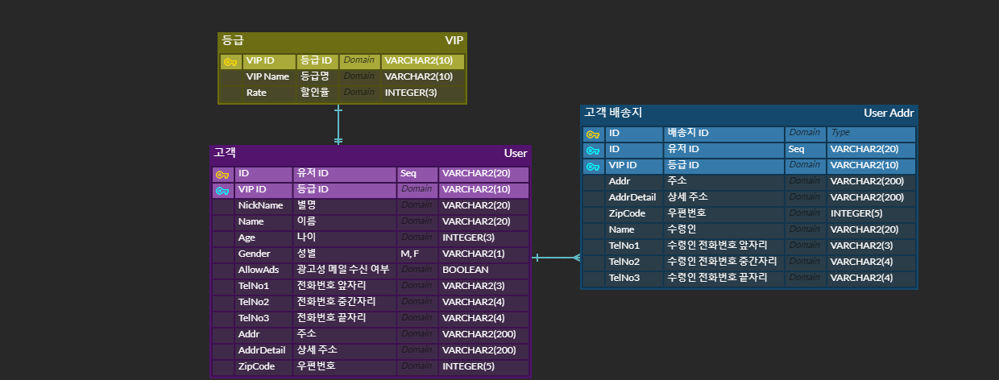

# DB설계, ERD실습
> DB설계, ERD실습

[ERD_Diagram Tool](https://www.erdcloud.com/)

### 쇼핑몰 회원정보 Database 설계

1. 회원 가입 시 필요한 고객의 기본 정보
   - 별명
   - 이름
   - 나이
   - 성별
   - 광고성 메일 수신 여부
2. 전화번호 (형식 선택)
   - 11자리
   - 3자리 + 8자리
   - 3자리 + 4자리 + 4자리 (✔)
3.  주소(배송지) (고객과 1:N 관계)
   - 주소
   - 상세 주소
   - 우편번호
   - 수령인 이름
   - 수령인 전화번호
4. VIP (고객과 1:1 관계)
   - VIP 등급
   - 할인율

### ERD Diagram

