# 산출물
> Jenkins CI/CD


### 0. Docker 설치

[공식 홈페이지](https://docs.docker.com/get-docker)

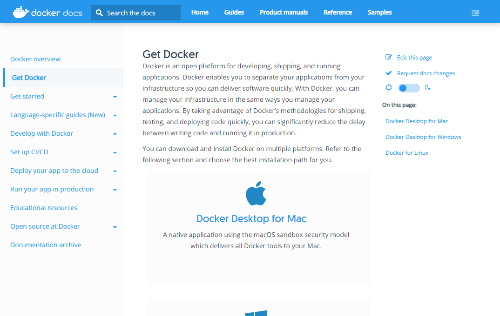


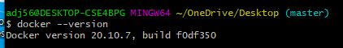


※ Windows Docker 설치 전 확인 사항

- CPU 가상화 사용

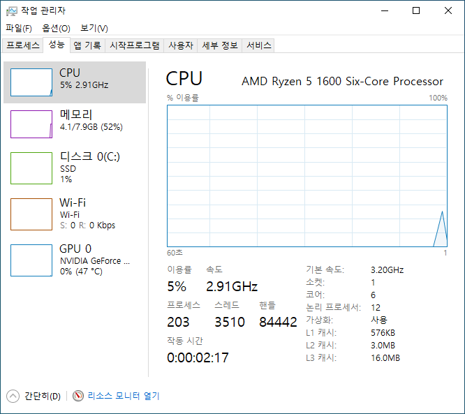

​	사용 안함으로 되어있을 시 BIOS에서 설정

- Linux 커널 업데이트

  [참고 사이트](https://blog.nachal.com/1691)

  

### 1. Docker 로 Jenkins 설치 및 설정

[Jenkins 공식 홈페이지](https://www.jenkins.io/)

- 설치 명령어

```
docker run -d -u root -p 9090:8080 --name=jenkins jenkins/jenkins
```

- 로컬로 접속 후 플러그인 설치

  - 비밀번호는 `docker logs jenkins` 에서 확인

    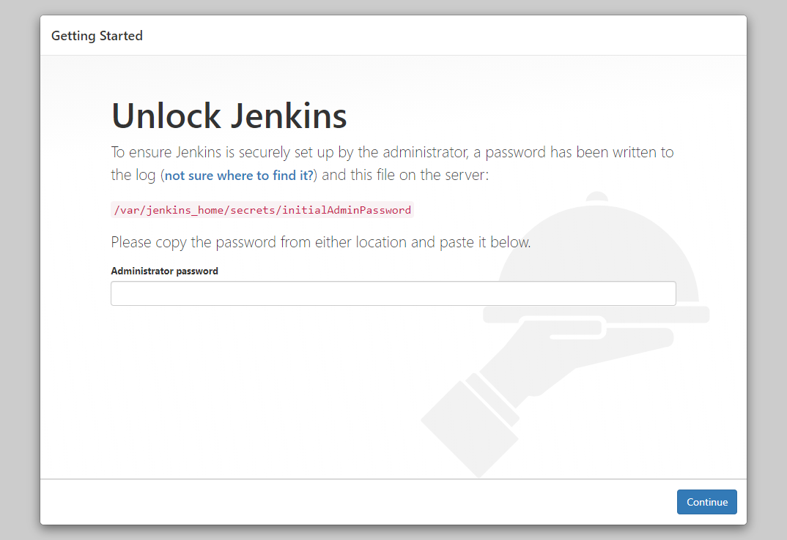

- 계정 생성 및 완료

  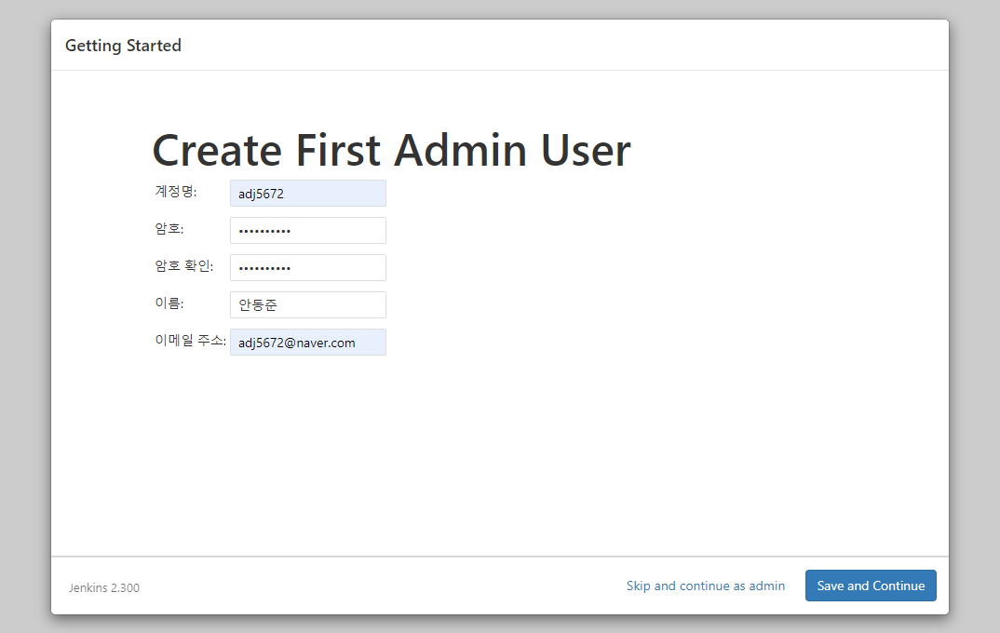

  

  .png)


### 2. Jenkins & Gitlab 연동

1. Gitlab access token 발행

   https://lab.ssafy.com/profile/personal_access_tokens

   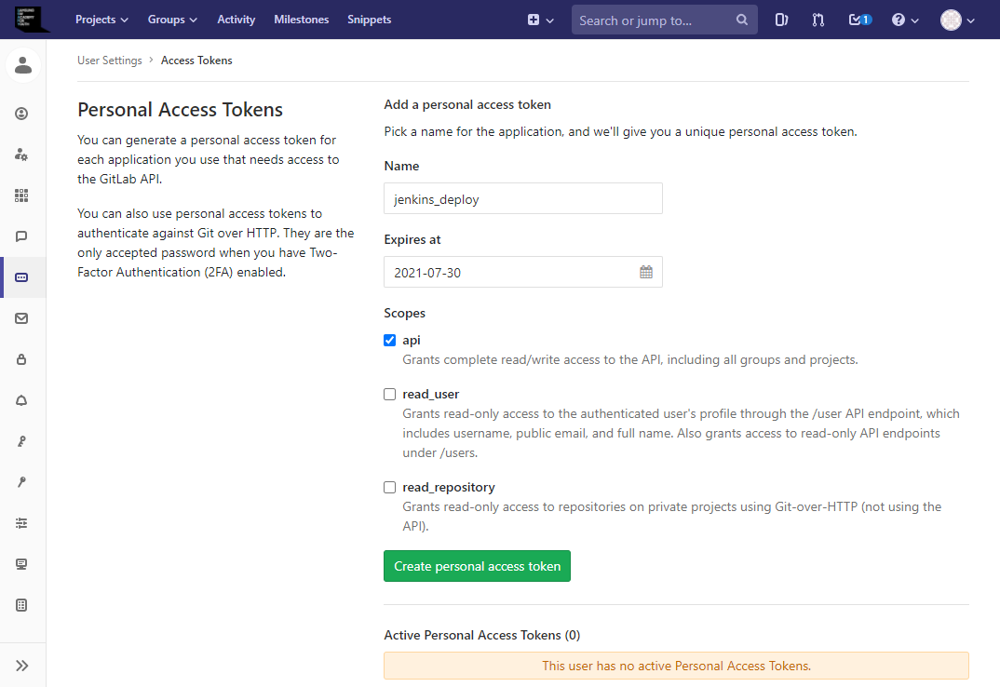

   

   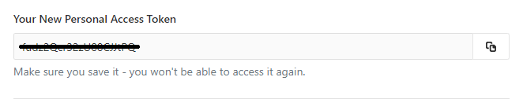

   

2. Jenkins 플러그인 설치

   http://localhost:9090/pluginManager/

   - 설치 목록

   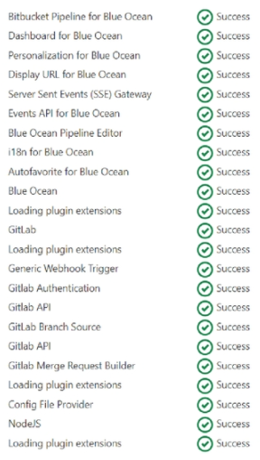


3. Gitlab 연동

   http://localhost:9090/configure

   - Credential 생성

     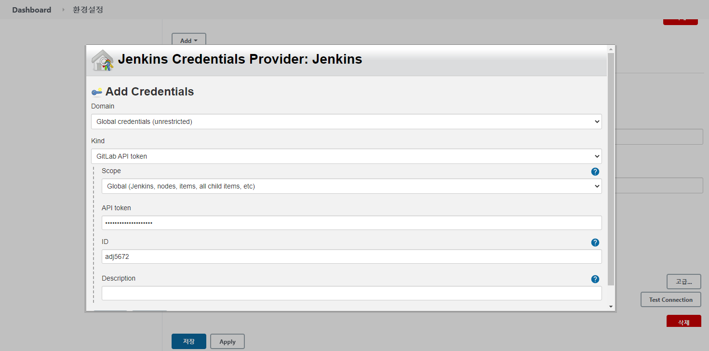

   - Test Connection

     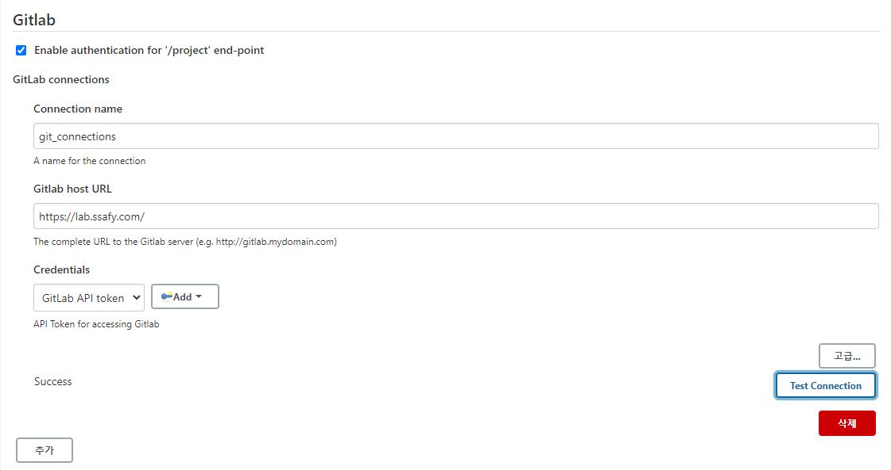


### 3. Nginx 설치 후 설정

1. 배포될 폴더 dist 생성

   ```
   mkdir dist
   ```


2. Nginx 설치

   ```
   docker pull nginx:latest
   
   docker run --name nginx -d -p 80:80 -v c:/Users/adj56/OneDrive/Desktop/dist:/usr/share/nginx/html nginx
   ```


3. index.html 생성 후 확인

   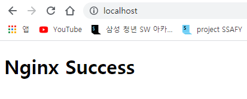


---


### Jenkins pipeline 생성

1. pipeline 생성

   http://localhost:9090/view/all/newJob

   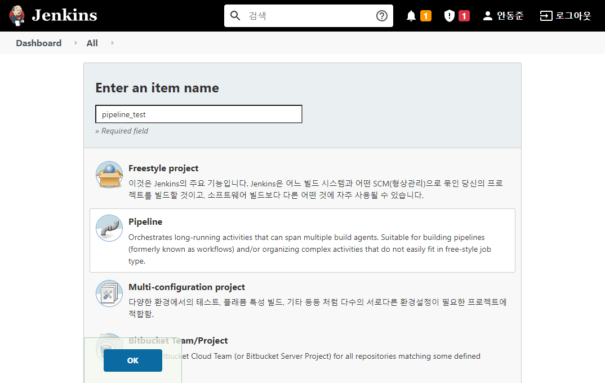


2. jenkins에 트리거 전송 시 필요한 screte token 생성

   - pipline_test => Build Trigger => Build when a change is pushed to GitLab. GitLab webhook URL: http://localhost:9090/project/pipeline_test => 고급

     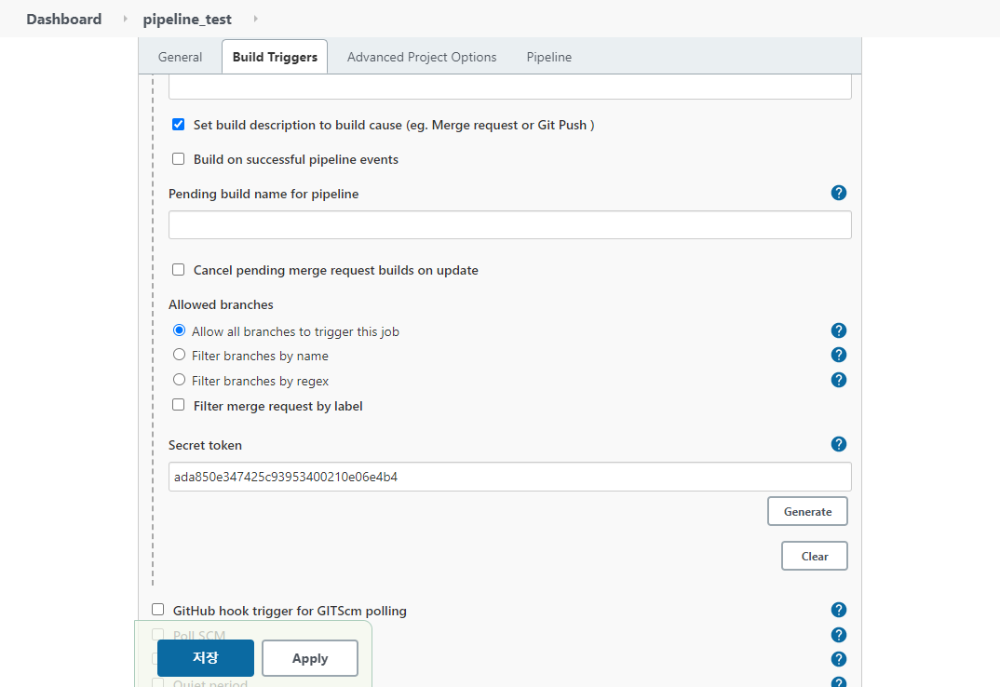


3. push 이벤트 trigger 생성

   - project - settings - integration

     - url : trigger 할 jenkins 작업 item URL
     - push events : 적용할 branch

     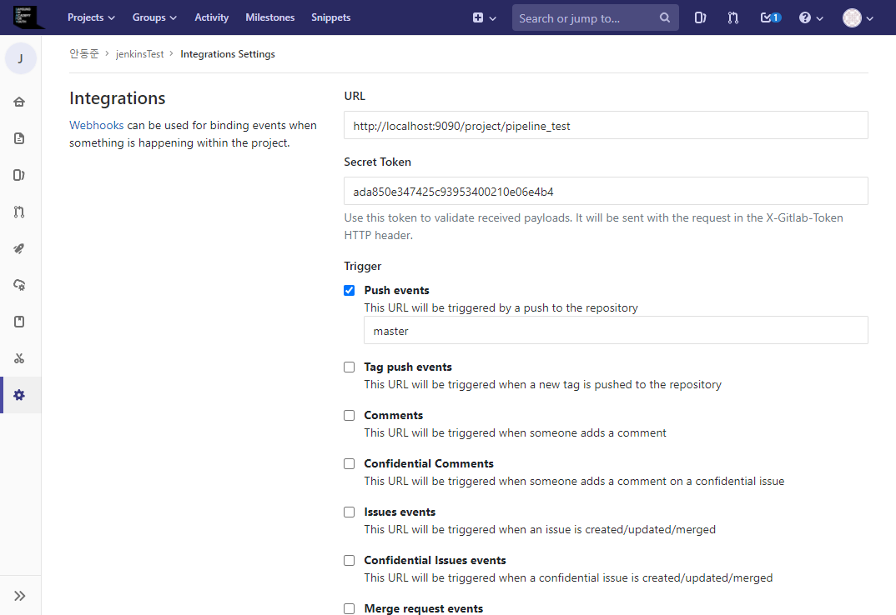

     

     **※ Webhook을 거는 부분에서 localhost 거부 오류 해결법**

     - ngrok 다운

       https://ngrok.com/download

     - ngrok http 9090 입력 (계속 켜놔야 함)

       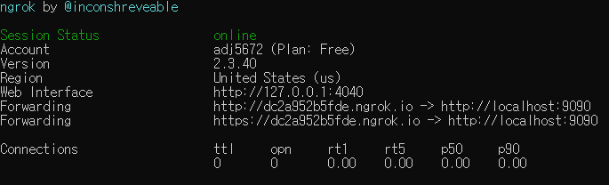

     

   - test 진행

     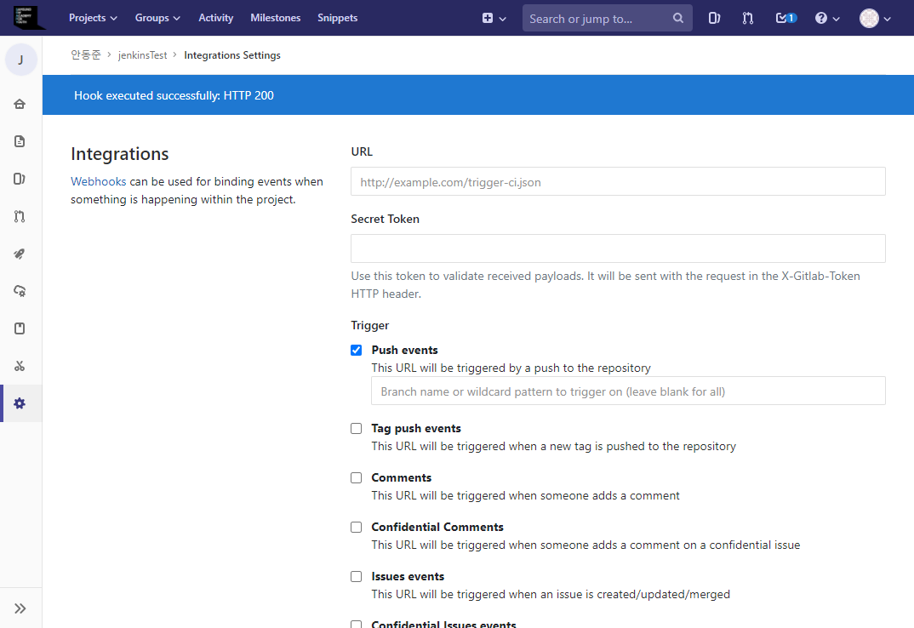


### Pipeline 작성

pipeline_test => 구성 => Pipeline

- 예시 코드

  ```
  pipeline {
      agent any //삭제하지 말 것
      tools {
          //도구명 사용 선언
      }
      
      stages {
          stage('prepare') {
              steps {
                  //Git pulling 및 빌드를 위한 npm install 로 라이브러리 다운로드
              }
          }
          stage('build') {
              steps {
                  //빌드 작업
              }
              post {
                  success {
                      //빌드 성공후 작업
                  }
              }
          }
      }
  }
  ```

  

---


### 배포 결과물

실패..

