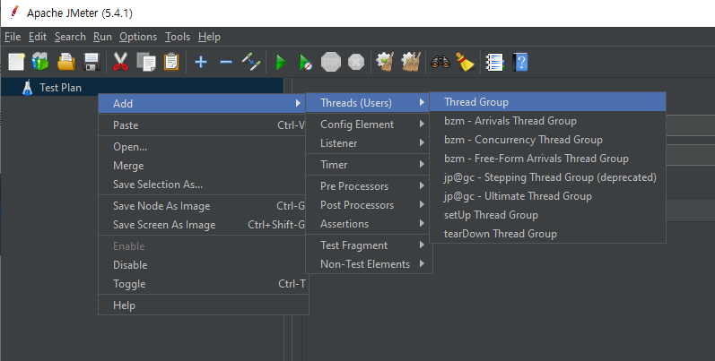

# Jmeter

- 대상 시스템의 개략적인 한계 부하(TPS) 측정 결과
  - 한계 부하 당시의 CPU, MEM 점유율(스크린샷)
  - 한계부하 기술

- 한계 부하 발생후의 그래프
  - TPS그래프
  - 응답속도 그래프
  - 유저 쓰레드 그래프 

---

### 1. Jmeter 다운로드

1. Jmeter 다운로드

   https://jmeter.apache.org/download_jmeter.cgi

   - bin 폴더의 jmeter.bat 으로 실행

     

2. 플러그인 매니저 및 플러그인 설치

   https://jmeter-plugins.org/install/Install/

   - `3-Basic Graph` 와 `jpgc-Standard Set` 설치

     

### 2. Jmeter 부하 테스트

1. Test Plan(우클릭) => Add => ThreadsGroup

   

2. ThreadGroup을 우클릭하여 항목 추가

   

3. ThreadGroup 항목 설정

   

   - Number of Threads : 가상의 유저의 숫자
   - Ramp-up Period : 한 번의 실행을 몇 초동안 완료시킬 것인지에 대한 설정값
   - Loop Count : 반복 횟수

4. HTTP Request 설정

   

   - 요청 보낼 Url 입력

### 2.1 Thread 가 10인 경우

- CPU, MEM

  

- TPS

  

- Response Times Over Time

  

- Active Threads Over Time

  

### 2.2 Thread 가 5000인 경우

- CPU, MEM

  

- TPS

  

- Response Times Over Time

  

- Active Threads Over Time

  

