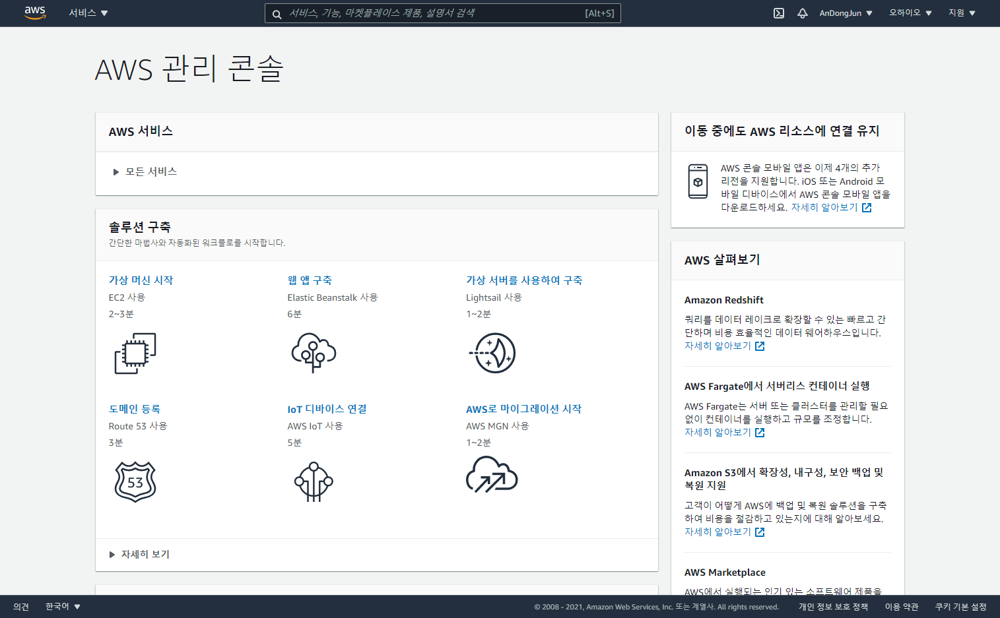
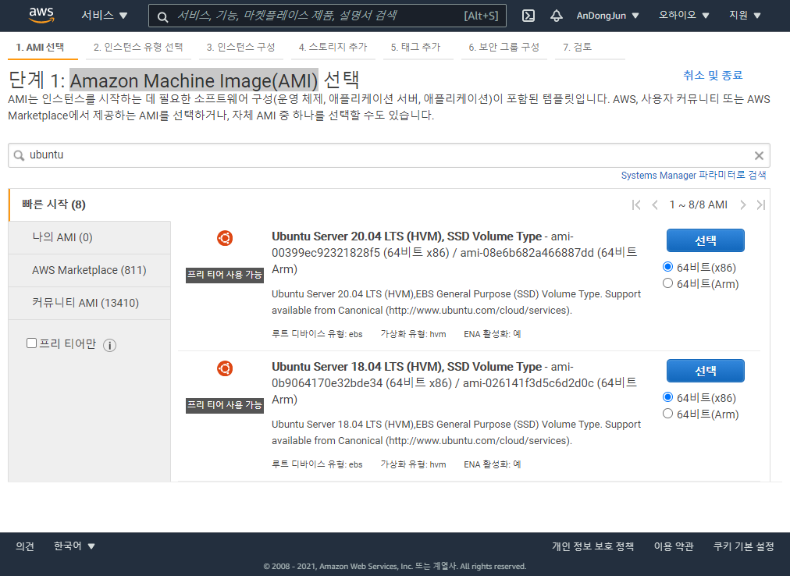
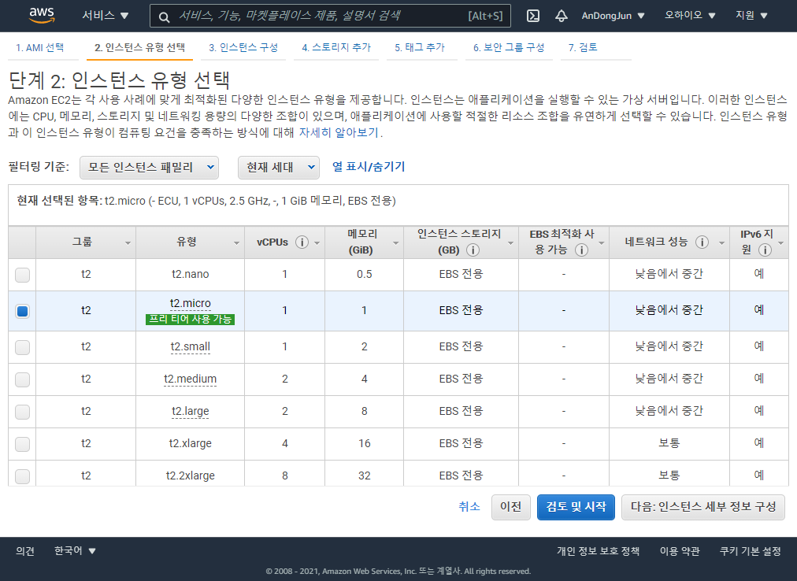
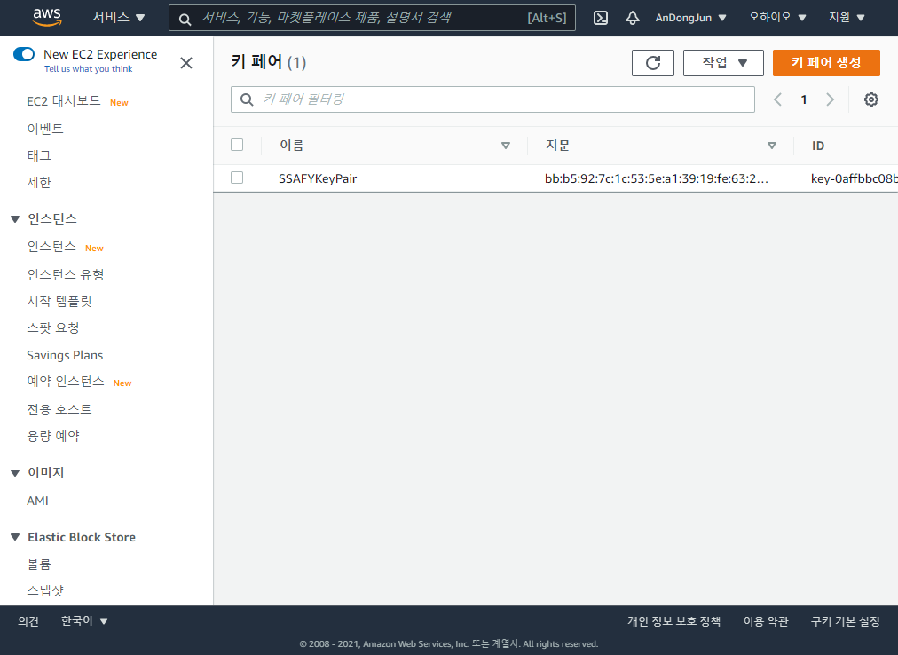
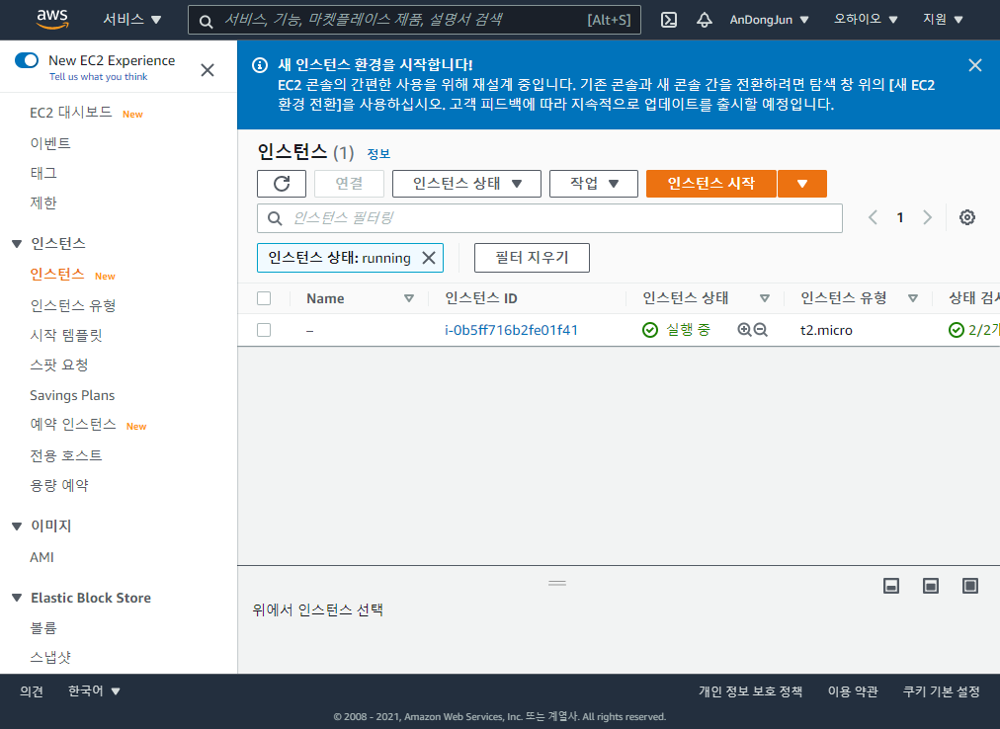
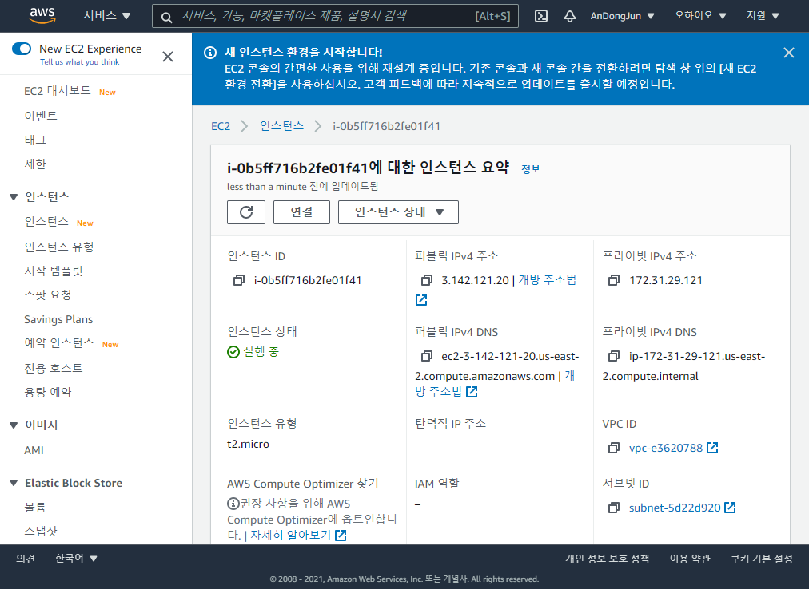
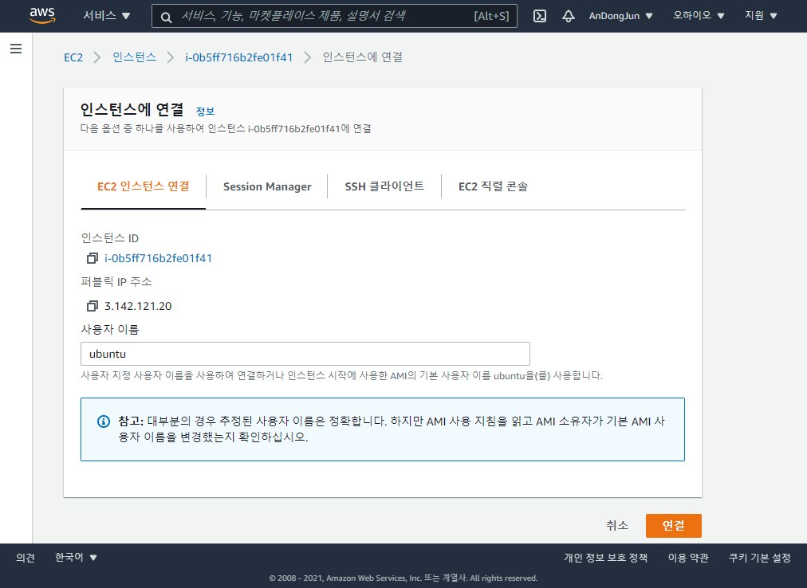
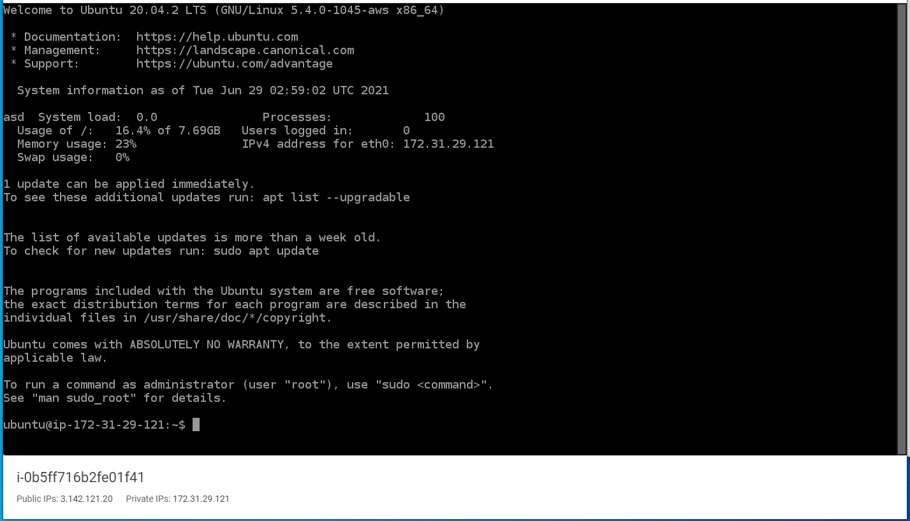

# 산출물
> Linux 머신 구하기

### 1. 인스턴스 생성 - AWS, Ubuntu

1. 계정 생성 및 EC2 시작

   

   AWS에 Free tier로 계정을 생성하고 가상 머신(EC2)를 시작한다.

   

2. Amazon Machine Image(AMI) 에서 Ubuntu 선택 (20.4)

   

   ubuntu 검색 후 **Ubuntu Server 20.04 LTS (HVM), SSD Volume Type** 을 선택한다.

   

3. 프리 티어로 사용 가능한 인스턴스를 선택한다.

   

   

4. 키 페어를 선택 또는 생성한다.

   

   키 페어는 추후에 인스턴스 연결에 필요하다.

   

5. 인스턴스 생성 완료

   

### 2. 인스턴스 연결

