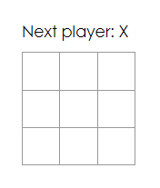
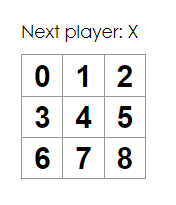
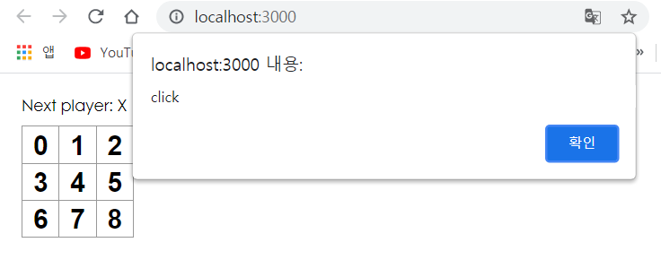
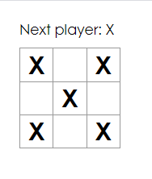

# React 실습

> Tic Tac Toe


### 1. 초기 코드 설정

1. index.css

   ```css
   body {
     font: 14px "Century Gothic", Futura, sans-serif;
     margin: 20px;
   }
   
   ol, ul {
     padding-left: 30px;
   }
   
   .board-row:after {
     clear: both;
     content: "";
     display: table;
   }
   
   .status {
     margin-bottom: 10px;
   }
   
   .square {
     background: #fff;
     border: 1px solid #999;
     float: left;
     font-size: 24px;
     font-weight: bold;
     line-height: 34px;
     height: 34px;
     margin-right: -1px;
     margin-top: -1px;
     padding: 0;
     text-align: center;
     width: 34px;
   }
   
   .square:focus {
     outline: none;
   }
   
   .kbd-navigation .square:focus {
     background: #ddd;
   }
   
   .game {
     display: flex;
     flex-direction: row;
   }
   
   .game-info {
     margin-left: 20px;
   }
   
   ```

2. index.js

   ```react
   import React from 'react';
   import ReactDOM from 'react-dom';
   import './index.css';
   
   class Square extends React.Component {
     render() {
       return (
         <button className="square">
           {/* TODO */}
         </button>
       );
     }
   }
   
   class Board extends React.Component {
     renderSquare(i) {
       return <Square />;
     }
   
     render() {
       const status = 'Next player: X';
   
       return (
         <div>
           <div className="status">{status}</div>
           <div className="board-row">
             {this.renderSquare(0)}
             {this.renderSquare(1)}
             {this.renderSquare(2)}
           </div>
           <div className="board-row">
             {this.renderSquare(3)}
             {this.renderSquare(4)}
             {this.renderSquare(5)}
           </div>
           <div className="board-row">
             {this.renderSquare(6)}
             {this.renderSquare(7)}
             {this.renderSquare(8)}
           </div>
         </div>
       );
     }
   }
   
   class Game extends React.Component {
     render() {
       return (
         <div className="game">
           <div className="game-board">
             <Board />
           </div>
           <div className="game-info">
             <div>{/* status */}</div>
             <ol>{/* TODO */}</ol>
           </div>
         </div>
       );
     }
   }
   
   // ========================================
   
   ReactDOM.render(
     <Game />,
     document.getElementById('root')
   );
   ```

​	

- Square - `<button>` 렌더링
- Board - 사각형 9개 렌더링
- Game - 게임판 렌더링


### 2. Props를 통해 데이터 전달

> Board => Square 로 props 전달

1. Square에 value prop 전달

   ```react
   class Board extends React.Component {
     renderSquare(i) {
       return <Square value={i} />;
     }
   ```

2. 전달받은 value 값 표시

   ```react
   class Square extends React.Component {
     render() {
       return (
         <button className="square">
           {this.props.value}
         </button>
       );
     }
   }
   ```

   


### 3. 사용자와 상호작용하는 컴포넌트 만들기

1. Square 클릭 시 X가 체크되도록 설정

   ```react
   class Square extends React.Component {
     render() {
       return (
         <button className="square" onClick={() => {
           alert('click')
         }}>
           {this.props.value}
         </button>
       );
     }
   }
   ```

   

2. class에 생성자를 추가하여 state를 초기화

   ```react
   class Square extends React.Component {
     constructor(props) {
       super(props);
       this.state = {
         value: null,
       };
     }
   ```

   - **주의** 

     [JavaScript 클래스](https://developer.mozilla.org/en-US/docs/Web/JavaScript/Reference/Classes)에서 하위 클래스의 생성자를 정의할 때 항상 `super`를 호출해야합니다. 

     모든 React 컴포넌트 클래스는 `생성자`를 가질 때 `super(props)` 호출 구문부터 작성해야 합니다.

3. Square에 state 값을 표시

   ```react
    render() {
       return (
         <button 
           className="square" 
           onClick={() => {
             this.setState({value: 'X'})
           }}
         >
           {this.state.value}
         </button>
       );
     }
   ```

   


### 4. State 끌어올리기

1. 부모 컴포넌트(Board)에 생성자 추가 및 9개의 null 배열을 초기 state로 설정

   ```react
   class Board extends React.Component {
     constructor(props) {
       super(props);
       this.state = {
         squares: Array(9).fill(null),
       };
     }
   ```

2. 각 Square에 props로 squares[i] 내려주기

   ```react
     renderSquare(i) {
       return <Square value={this.state.squares[i]} />;
     }
   ```

3. 클릭 시 Board에서 Square로 함수 전달

   ```react
     renderSquare(i) {
       return (
         <Square 
           value={this.state.squares[i]} 
           onClick={() => this.handleClick(i)}
         />
       );
     }
   ```

4. Square props 적용

   ```react
   class Square extends React.Component {
     render() {
       return (
         <button 
           className="square" 
           onClick={() => {
             this.props.onClick()
           }}
         >
           {this.props.value}
         </button>
       );
     }
   }
   ```

   - Square 클릭시 동작 과정
     1. 내장된 DOM `<button>` 컴포넌트에 있는 `onClick` prop은 React에게 클릭 이벤트 리스너를 설정하라고 알려줍니다.
     2. 버튼을 클릭하면 React는 Square의 `render()` 함수에 정의된 `onClick` 이벤트 핸들러를 호출합니다.
     3. 이벤트 핸들러는 `this.props.onClick()`를 호출합니다. Square의 `onClick` prop은 Board에서 정의되었습니다.
     4. Board에서 Square로 `onClick={() => this.handleClick(i)}`를 전달했기 때문에 Square를 클릭하면 `this.handleClick(i)`를 호출합니다.
     5. 아직 `handleClick()`를 정의하지 않았기 때문에 코드가 깨질 것입니다. 지금은 사각형을 클릭하면 “this.handleClick is not a function”과 같은 내용을 표시하는 붉은 에러 화면을 보게됩니다.

5. handleClick 정의

   ```react
     handleClick(i) {
       const squares = this.state.squares.slice()
       squares[i] = 'X'
       this.setState({squares: squares})
     }
   ```

   - .slice()를 사용하여 squares 배열의 사본 생성 (이유는 다음과 같다.)


### 5. 불변성이 중요한 이유

이전 코드 예시에서 기존 배열을 수정하는 것이 아니라 `.slice()` 연산자를 사용하여 `squares` 배열의 사본 만들기를 추천했습니다. 지금부터 불변성이 무엇인지와 왜 불변성이 중요한지 알아보겠습니다.

일반적으로 데이터 변경에는 두 가지 방법이 있습니다. 첫 번째는 데이터의 값을 직접 *변경*하는 것입니다. 두 번째는 원하는 변경 값을 가진 새로운 사본으로 데이터를 교체하는 것입니다.

#### 객체 변경을 통해 데이터 수정하기

```react
var player = {score: 1, name: 'Jeff'};
player.score = 2;
// 이제 player는 {score: 2, name: 'Jeff'}입니다.
```

#### 객체 변경 없이 데이터 수정하기

```react
var player = {score: 1, name: 'Jeff'};

var newPlayer = Object.assign({}, player, {score: 2});
// 이제 player는 변하지 않았지만 newPlayer는 {score: 2, name: 'Jeff'}입니다.

// 만약 객체 spread 구문을 사용한다면 이렇게 쓸 수 있습니다.
// var newPlayer = {...player, score: 2};
```

최종 결과는 동일하지만 직접적인 객체 변경이나 기본 데이터의 변경을 하지 않는다면 아래에 기술된 몇 가지 이점을 얻을 수 있습니다.

#### 복잡한 특징들을 단순하게 만듦

불변성은 복잡한 특징들을 구현하기 쉽게 만듭니다. 자습서에서는 “시간 여행” 기능을 구현하여 틱택토 게임의 이력을 확인하고 이전 동작으로 “되돌아갈 수 있습니다”. 이 기능은 게임에만 국한되지 않습니다. 특정 행동을 취소하고 다시 실행하는 기능은 애플리케이션에서 일반적인 요구사항 입니다. 직접적인 데이터 변이를 피하는 것은 이전 버전의 게임 이력을 유지하고 나중에 재사용할 수 있게 만듭니다.

#### 변화를 감지함

객체가 직접적으로 수정되기 때문에 복제가 가능한 객체에서 변화를 감지하는 것은 어렵습니다. 감지는 복제가 가능한 객체를 이전 사본과 비교하고 전체 객체 트리를 돌아야 합니다.

불변 객체에서 변화를 감지하는 것은 상당히 쉽습니다. 참조하고 있는 불변 객체가 이전 객체와 다르다면 객체는 변한 것입니다.

#### React에서 다시 렌더링하는 시기를 결정함

불변성의 가장 큰 장점은 React에서 *순수 컴포넌트*를 만드는 데 도움을 준다는 것입니다. 변하지 않는 데이터는 변경이 이루어졌는지 쉽게 판단할 수 있으며 이를 바탕으로 컴포넌트가 다시 렌더링할지를 결정할 수 있습니다.

`shouldComponentUpdate()`와 *순수 컴포넌트*를 작성하는 법에 대해 더 알아보고 싶다면 [성능 최적화하기](https://ko.reactjs.org/docs/optimizing-performance.html#examples)를 보세요.


### 6. 함수 컴포넌트

