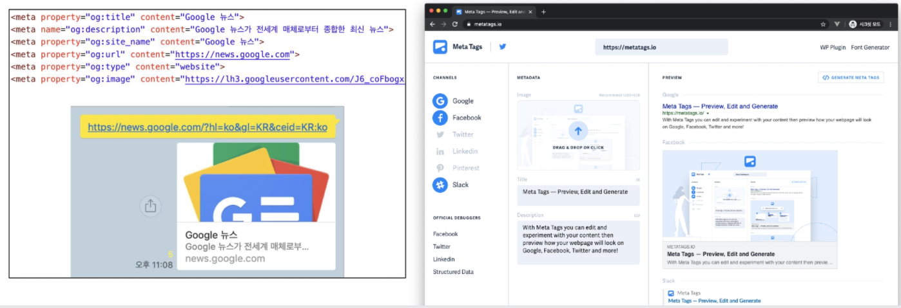
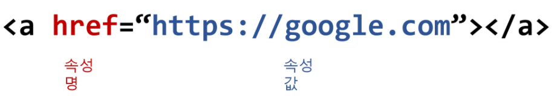

# HTML

> Hyper Text Markup Language


비선형적으로 이루어진 텍스트를 의미하며, 기본적으로 HyperLink를 통해 텍스트로 이동한다.

__웹 페이지를 작성하기 위한 언어__ - 웹 컨텐츠의 의미와 구조를 정의

[구글 HTML 스타일 가이드](https://google.github.io/styleguide/htmlcssguide.html)

[HTML 유효성 검사](https://validator.w3.org/nu/)


---


### HTML 기본 구조

```html
<!DOCTYPE html>
<html lang="en">
<head>
  <meta charset="UTF-8">
  <meta http-equiv="X-UA-Compatible" content="IE=edge">
  <meta name="viewport" content="width=device-width, initial-scale=1.0">
  <title>Document</title>
</head>
<body>
  
</body>
</html>
```

 

#### head 요소

문서 제목, 문자코드와 같이 해당 문서 정보를 담고 있으며 브라우저에 나타나지 않는다.

CSS 선언 혹은 외부 로딩 파일 지정 등도 작성


_※ 메타 데이터를 표현하는 새로운 규약, Open Graph Protocol_ 

- HTML 문서의 메타 데이터를 통해 문서의 정보를 전달
- 페이스북에서 만들었으며, 메타정보에 해당하는 제목, 설명 등을 쓸 수 있도록 정의




#### body요소

브라우저 화면에 나타나는 정보로 실제 내용에 해당한다.


#### 요소(element)

HTML의 요소는 태그와 내용(contents)로 구성


#### 속성(attribute)  

태그별로 사용할 수 있는 속성은 다르다.




#### 시맨틱 태그

HTML5에서 의미론적 요소를 담은 태그의 등장

- header : 문서 전체나 섹션의 헤더

- nav : 내비게이션

- aside : 사이드에 위치한 공간
- section : 문서의 일반적은 구분
- article : 문서, 페이지, 사이트 안에서 독립적으로 구분되는 영역
- footer : 문서 전체나 섹션의 푸터

검색 엔진 최적화(SEO)를 위해서 메타태그, 시맨틱 태그 등을 통한 마크업을 효과적으로 할 필요가 있다.


#### 그룹 컨텐츠

```
<p>, <hr>, <ol>, <ul>, <pre>, <blockquote>, <div>
```


#### 텍스트 관련 요소

```
<a>, ( <b>, <strong> ), <i>, <em>, <span>, <br>, , etc
```


#### 테이블

```
<tr>, <td>, <th>, <thead>, <tbody>, <tfoot>, <caption>, <col>, <colgroup>
```


#### Form

`<form>` 은 서버에서 처리될 데이터를 제공하는 역할

`<form>` 의 기본 속성 - action, method


#### Input

다양한 타입을 가지는 입력 데이터 필드

`<label>` : 서식 입력 요소의 캡션

`<input>` 공통 속성 - name, placeholder, required, autofocus


---


