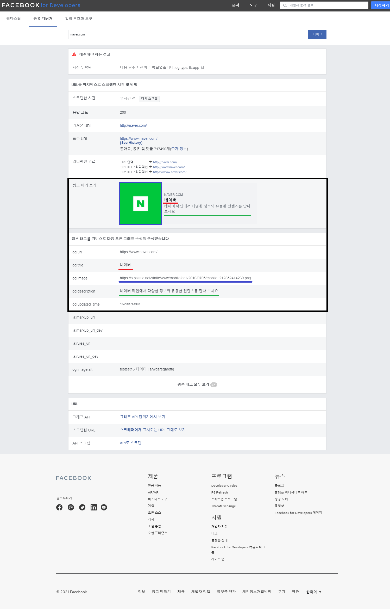

# OGP (Open Graph Protocol)

[공식 문서](https://ogp.me/)

페이스북에서 최초로 정의한 메타 태그 규약

웹 페이지의 특정 정보를 미리 간략하게 정리하여 제공

※ HTML에서 공식적으로 지원하는 기능은 아닌만큼 각 업체별로 조금씩 다를 수 있다. (ex. 트위터)

### Basic Metadata

| 속성         | 설명                     | 사용법                                                     |
| ------------ | ------------------------ | ---------------------------------------------------------- |
| **og:title** | 웹사이트의 제목          | <meta property=''og:title'' content="제목" />              |
| **og:type**  | 웹사이트의 종류          | <meta property=''og:type'' content="website" />            |
| **og:url**   | 웹사이트의 정식 URL      | <meta property=''og:url'' content="http://주소" />         |
| **og:image** | 웹사이트를 나타낼 이미지 | <meta property=''og:image'' content=”http://이미지.jpg" /> |

Optional Metadata 및 Structured Properties, 기타 자세한 내용은 공식 문서 참조

---

### Debug 사이트

https://developers.facebook.com/tools/debug/

(예시) `https://www.naver.com`

