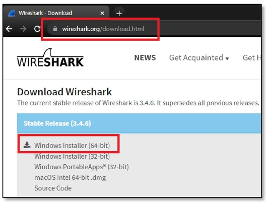
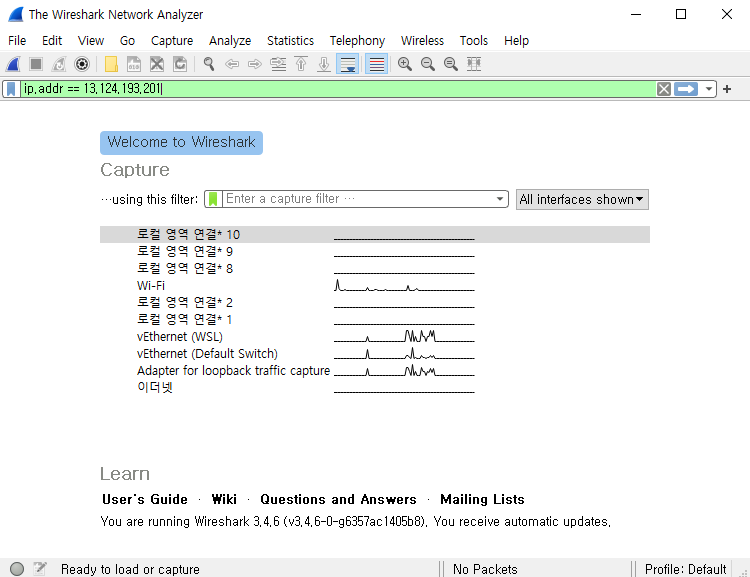
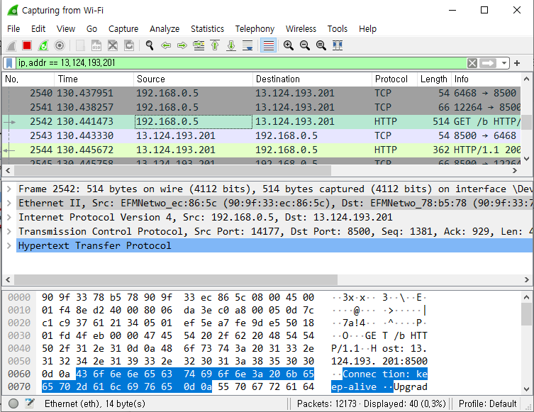
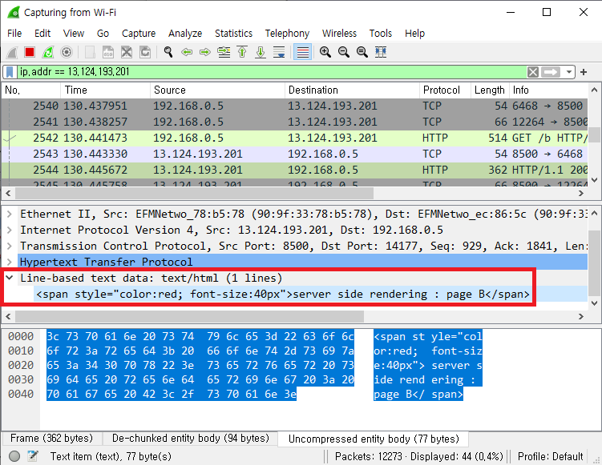
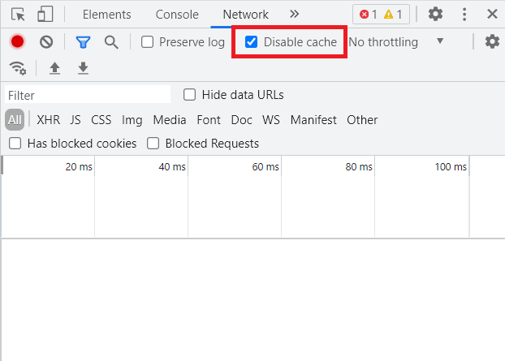
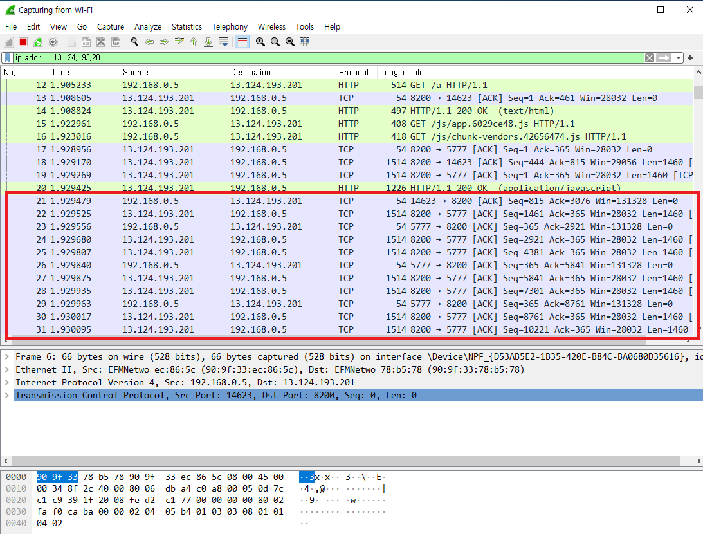
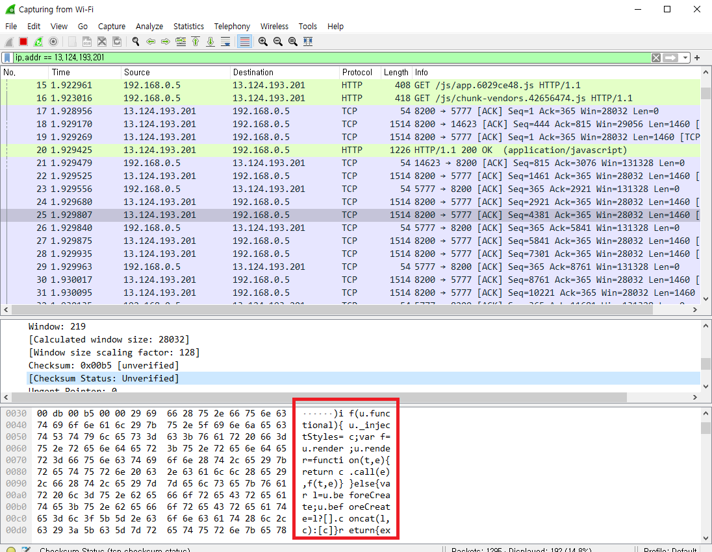
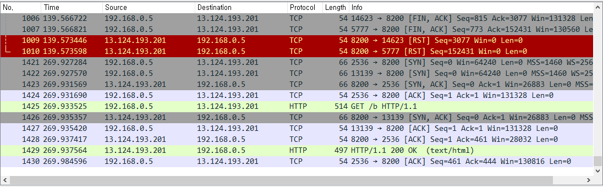

# SSR & CSR
> SSR & CSR

### 1. SSR & CSR

- SSR (Server Side Rendering)

  Web Server에서 View을 생성한다. Page가 전환 될 때 마다, Client가 Server에 View 요청을 하고, Server는 그것을 생성 후 Client에게 보내준다. 때문에 View 전환 속도가 CSR에 비해 상대적으로 늦다. 그리고 page 요청이 빈번해 질수록 CSR에 비해 Server 부하가 더 커진다.

- CSR (Client Side Rendering)

  Brower(Client)에서 JS에 의해 View(HTML)을 동적으로 생성한다. 때문에 page 전환이 SSR 보다 상대적으로 빠르다. 대신 최초 접속 시, 모든 JS, static 파일을 가져와야 한다. 때문에 최초 접속 시 로딩은 SSR에 비해 늦다.

### 2. SPA, MPA

- SPA (Single Page Application)

  - SPA는 CSR 방식으로 작동하는 웹 어플리케이션

  - 대표적인 framework로는 Vue와 React가 있다.

  - SPA Web Service - http://13.124.193.201:8200/a, http://13.124.193.201:8200/b

- MPA (Multi Page Application)

  - MPA는 SSR 방식으로 작동하는 웹 어플리케이션
  - 대표적인 framework로는 PHP가 있다.
  - MPA Web Service - http://13.124.193.201:8500/a, http://13.124.193.201:8500/b 

### 3. Wire Shark

- 와이어샤크 (Wireshark)는 자유 및 오픈 소스 패킷 분석 프로그램이다. 

- 네트워크의 문제, 분석, 소프트웨어 및 통신 프로토콜 개발, 교육에 쓰인다.

- Wire Shark로 SPA, MPA 에서 page 전환 시 네트워크 요청 & 응답을 살펴본다.

1. Wire Shark 설치

   

2. 필터 설정

   

### 4. MPA

- page a <=> page b를 번갈아 전환

- View가 바뀔 때마다 Client와 Server간 View를 요청 & 응답하는 packet이 생성되는지 확인

  - 요청

    

  - 응답

    

### 5. SPA

- SPA 접속 후, 최초 접속 시 JS 및 static file를 download 받는지 확인

  - 확인 전 Browser 에서, download cache 기능이 있기 때문에, Disable cache 설정

    

    

  - download 확인

    

    

  - JS & static packet 파일 내용확인

    

- page a  <=> page b 전환 시 더 이상 packet이 capture 되지 않는다.

  

